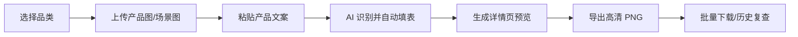

# 小玺AI · 产品详情页自动生成器 ✨


<p align="center">
  
  
  
  
</p>

> 上传产品图 + 粘贴产品文案，AI 自动提取参数、生成卖点、拼装电商详情页模块，并一键导出高清 PNG 长图。

小玺AI 面向产品图批量生产场景：把「产品资料整理 → AI 解析 → 模板拼装 → 截图导出 → 批量下载」压成一条可复用流水线，适合清洁设备、配件、耗材、工具等工业/商用商品详情页制作。

---

## 🔥 核心能力

| 能力 | 说明 |
|---|---|
| 🤖 AI 文案解析 | 粘贴产品文案后，自动提取型号、参数、卖点、适用场景等字段 |
| 🧩 积木式详情页 | 英雄屏、优势网格、清洁故事、VS 对比、参数表等模块自由组合 |
| 🖼️ 产品图处理 | 支持 rembg 自动抠图、场景图融合、AI 背景图缓存/实时生成 |
| ⚡ 批量工作台 | 文件夹上传、多产品队列、任务状态、历史批次、单品/整批下载 |
| ✅ 高清导出 | Playwright 渲染详情页，输出 750px 宽电商长图 PNG |
| 🔐 多用户与权限 | 登录注册、管理后台、用量统计、API Key 加密存储与权限隔离 |

---

## ✨ 视觉预览

### 主题风格

<p align="center">
  
  
  
  
</p>

### 场景素材

<p align="center">
  
  
  
  
</p>

---

## 🚀 工作流



---

## 🛠️ 快速开始

### 1. 安装依赖

```bash
pip install -r requirements.txt
playwright install chromium
```

### 2. 配置环境变量

复制 `.env.example` 为 `.env`，并按需补齐密钥和运行参数：

```bash
cp .env.example .env
```

生产环境变量可参考 [ENV_TEMPLATE.md](ENV_TEMPLATE.md)。常见必填项包括：

| 变量 | 用途 |
|---|---|
| `SECRET_KEY` | Flask session / CSRF 签名 |
| `FERNET_KEY` | 用户 API Key 加密 |
| `DEEPSEEK_API_KEY` | 文案 AI 解析 |
| `REFINE_API_KEY` | AI 精修接口 |
| `REFINE_API_BASE_URL` | AI 精修 endpoint |

### 3. 启动应用

```bash
python app.py
```

访问：<http://localhost:5000>

---

## 📦 Docker 部署

```bash
docker build -t xiaoxi-ai-detail .
docker run -d --name xiaoxi-ai-detail \
  -p 5000:5000 \
  -e SECRET_KEY="你的密钥" \
  -e FERNET_KEY="你的加密 key" \
  -e DEEPSEEK_API_KEY="你的 DeepSeek key" \
  -e REFINE_API_KEY="你的精修 key" \
  -e REFINE_API_BASE_URL="你的精修 endpoint" \
  --restart unless-stopped \
  xiaoxi-ai-detail
```

更完整的云服务器部署、滚动升级、回滚与验收流程见 [DEPLOYMENT.md](DEPLOYMENT.md)。

---

## 🧠 技术栈

| 模块 | 技术 |
|---|---|
| Web 应用 | Flask, Jinja2, Flask-Login, Flask-WTF |
| AI 文案 | DeepSeek API |
| AI 精修/背景 | Seedream / 外部精修 API 路由 |
| 图像处理 | Pillow, rembg, onnxruntime |
| 截图导出 | Playwright Chromium |
| 数据与迁移 | SQLite, SQLAlchemy, Alembic, Postgres-ready |
| 实时进度 | Flask-Sock, memory/Redis PubSub |

---

## 🗂️ 项目结构

```text
app.py                    # Flask 主应用与路由
admin.py                  # 管理后台
auth.py                   # 登录注册
models.py                 # 数据模型
batch_upload.py           # 批量上传与文件夹扫描
batch_processor.py        # 批量生成流水线
refine_processor.py       # AI 精修队列
templates/
  batch/                  # 批量上传、历史与工作台页面
  blocks/                 # 详情页积木模块
  设备类/ 配件类/ 耗材类/ 工具类/
static/
  themes/                 # 主题预览 SVG
  scenes/                 # 通用场景图
docs/                     # PRD、部署、复盘与交接文档
tests/                    # 回归测试与安全/批量流程测试
```

---

## 🧪 验证

```bash
pytest
```

常用专项验证脚本：

```bash
python scripts/verify_refine_v2_kwargs.py
python scripts/smoke_pipeline_schema.py
powershell -ExecutionPolicy Bypass -File scripts/check_local_dev_env.ps1
```

---

## 🧷 当前边界

- ✅ 适合内部生产、客户演示、批量生成与工作台复查。
- ⚠️ 生产部署前必须确认 `.env`、密钥托管、数据库备份、费用上限和用户权限策略。
- 🔒 `.env`、数据库文件、用户上传与导出产物不进 git。

---

## 📄 许可

仅供内部使用。
