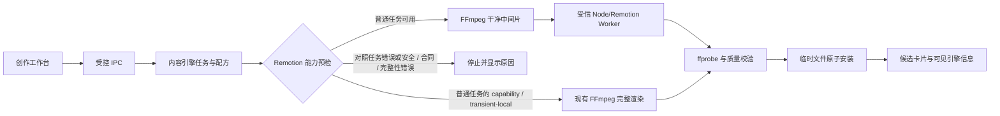
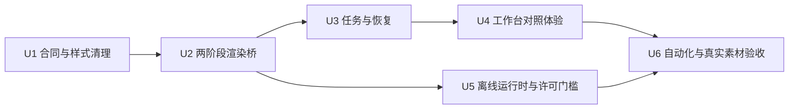

# Remotion 高质动态包装正式接入 - Plan

## Goal Capsule

把已经验证过的三套 Remotion 视觉样片接入现有创作工作台，使“长课程精剪”和“AI 批量混剪”能稳定生成更接近 2026 年短视频观感的动态包装成片。百炼继续理解内容并建议元素出现的语义位置；本地布局规则负责安全排版；FFmpeg 负责剪切、混剪、构图和音频；Remotion 负责动态字幕、标题、SVG、贴纸与转场表现。

执行范围是代码实现和真实素材内测。首轮只做同一内容的三风格对照，不触发新的 APIMart 封面调用，也不执行 5+5 付费验收、30 条混剪验收或真实发布。商业安装包在 Remotion 许可未确认前不得交付。

实施者可以在不改变 R-ID 行为的前提下调整内部类名和文件拆分。遇到付费调用、商业许可不明、真实发布或删除历史数据时必须停止并取得用户授权。

## Product Contract

### Summary

正式工作台保留“长课程精剪”和“AI 批量混剪”两个入口，并新增可选的“高质动态包装”能力。现有六套语义模板继续决定内容怎么组织；三套 Remotion 视觉风格只决定内容如何表现。第一轮从已有成片中选择三种不同内容骨架，每种内容复用相同选段、声音、字幕时间码、编导事件和封面，分别渲染三种视觉风格，共生成九条可播放对照片。

### Problem Frame

当前正式成片已经具备选段、字幕和基础包装，但视觉语言仍偏静态。已有 Remotion 样片证明弹性标题、SVG、关键词贴纸和提示音方向可行，但样片脚本每次重新打包、只支持单一整段视频、会搜索系统浏览器，并带有无内容依据的装饰文字。直接把样片塞入正式工作台会造成课程时间码错误、混剪结构丢失、运行缓慢、密钥环境泄露和会议室安装失败。

### Actors

- A1. 内容制作人员：选择素材、模式和高质包装，查看预估调用数，比较三种视觉风格并选择内部验收版本。
- A2. 内部验收人员：在电脑和手机上检查画面、字幕、声音与内容匹配度，不执行真实发布。
- A3. 系统维护者：确认 Remotion 商业许可、固定运行时版本，并从干净提交构建测试安装包。

### Requirements

#### 产品入口与结果

- R1. 正式界面只保留“长课程精剪”和“AI 批量混剪”，高质动态包装作为两种模式中的可选渲染能力，不新增多轨时间线或复杂编辑器。
- R2. 六套现有语义模板与三套视觉风格使用不同字段和版本号，系统不得用 `packagingPresetId` 表示 Remotion 风格。
- R3. 普通生成请求指定高质包装但运行能力不可用时，可以生成一条 FFmpeg 回退成片；成片卡片必须显示实际引擎和可核验的回退原因。
- R4. 三风格对照在 Remotion 不可用时必须在预检阶段终止，不得生成三条相同的 FFmpeg 成片冒充对照结果。
- R5. 对照任务生成新的候选版本，不覆盖原成片；已完成的单个风格结果在暂停、取消或崩溃后仍可播放和复用。

#### AI 编导与安全排版

- R6. 百炼只输出有素材依据的事件类型、文字、起止时间、优先级、表现意图以及首选语义区域或尺寸；不得输出或控制任意像素坐标。
- R7. 本地版本化布局网格必须校验、改派或丢弃越界、遮挡主体、遮挡课件、密度过高或彼此冲突的事件。
- R8. 字幕、标题、SVG、贴纸和提示音必须由转写、画面标签、选段理由或品牌包支撑；删除 `LIVE / AI PACK`、`FIELD NOTE`、`VISION / SEMANTIC EVENT STREAM` 等无依据装饰文案。
- R9. 同一条内容的三风格对照必须复用同一份编导计划、字幕时间码、源时间码、音频处理和封面，视觉风格是唯一变量。

#### 渲染、恢复与成本

- R10. FFmpeg 先生成无字幕、无标题、无贴纸的 9:16 干净中间片；Remotion 再加入视觉包装；普通回退继续使用现有完整 FFmpeg 渲染链。
- R11. 系统在渲染前持久化请求引擎、视觉风格、模板版本、编导计划摘要和对照来源；渲染后持久化实际引擎、实际版本和回退代码。
- R12. 预检必须分别显示百炼请求数、APIMart 请求数和本地渲染数。首轮选择已有有效编导计划的三个候选时，预期值固定为 0、0、9。
- R13. 本地渲染失败可以恢复；结果不明的云端付费操作不得自动重提。本轮对照不得重新选段、重新分析或重做封面。

#### 安全、兼容与交付

- R14. Remotion 子进程只接收允许列表中的运行时和任务信息；百炼 Key、APIMart Key、本地源路径、用户环境和完整配方不得进入命令行、公开 props、日志、缓存、崩溃报告或错误消息。
- R15. 旧配方缺少视觉引擎字段时保持现有 FFmpeg 行为；安装包运行时必须固定 Remotion `4.0.512`、同版本原生组件、预构建模板和显式浏览器，并在启动前验证受信清单，不得在运行时静默下载依赖。
- R16. 商业交付必须同时满足 Remotion 许可已书面确认、工作树干净、提交与受签清单一致、离线实机渲染通过；开发、内部评估和交付制品必须可辨识且不能互相包装。

### Flows

- F1. 普通生成（覆盖 R1-R3、R6-R8、R10-R15）：用户选择模式和高质包装，预检显示调用数，系统持久化配方，生成干净中间片，执行 Remotion 包装并验证成片；若能力不可用，按 R3 生成并标记 FFmpeg 回退。
- F2. 三风格对照（覆盖 R4-R5、R9、R11-R13）：用户选择一个已有候选，系统验证编导计划和 Remotion 能力，创建一个分组任务，依次生成三种风格的新版本，并在卡片中分组显示。
- F3. 暂停与恢复（覆盖 R5、R11、R13）：系统完成当前候选后暂停，保留已完成版本；恢复时只渲染未完成版本，并复用原编导计划和封面。
- F4. 内部验收（覆盖 R9、R12、R16）：系统对三种内容骨架各生成三种风格，验收人员在手机上比较并记录胜出风格，不进入发布队列。

### Acceptance Examples

- AE1. 覆盖 R4、R9、R12：已有候选带有效编导计划时，预检显示“百炼 0 次、APIMart 0 次、本地渲染 3 次”；任务输出三种不同 Remotion 风格。
- AE2. 覆盖 R3、R11：普通课程生成请求高质包装，但本机浏览器能力缺失时，系统只输出一条可播放 FFmpeg 成片，并显示 `actualEngine=ffmpeg` 和稳定的回退代码。
- AE3. 覆盖 R4：三风格对照检测不到 Remotion 能力时，系统不创建三个候选，也不发生云端调用。
- AE4. 覆盖 R5、R13：对照任务完成第一种风格后进程退出；重启恢复时第一条保持可播放，只渲染剩余两条，百炼和 APIMart 账本不增加。
- AE5. 覆盖 R6-R8：百炼提出左上区域事件，但该区域与课件或人物保护区冲突时，本地布局改派到合法区域；没有合法区域时丢弃事件。
- AE6. 覆盖 R14：即使主 sidecar 环境含云端 Key，Remotion 子进程环境、标准输出、错误信息和公开候选结果中也不存在 Key 或真实素材路径。
- AE7. 覆盖 R15-R16：断网的会议室电脑使用与提交一致的内部测试包，可以完成短样片渲染；未记录商业许可时交付构建明确失败。

### Success Criteria

- 三种内容骨架各生成三种视觉风格，共九条 1080×1920、30fps、H.264/AAC 成片。
- 同一组三条成片的源时间码、字幕文字、音频时长和封面一致，只有视觉包装不同。
- 九条成片无黑帧、爆音、明显音画错位和字幕遮挡；字幕与声音误差不超过 500ms。
- 手机竖屏验收中至少三条可不进入开拍或剪映而直接作为内部发布候选。
- 至少一种视觉风格在三组对照中赢得两组，作为下一轮默认候选；没有风格达标时保留 FFmpeg 默认并继续设计迭代。
- 首轮对照的账本与预检一致：百炼 0 次、APIMart 0 次、本地渲染 9 次。

### Scope Boundaries

本轮包含正式 Remotion 渲染桥、三风格对照、运行能力预检、可见回退、恢复、安装运行时和真实素材内测。

本轮不包含新的视觉风格设计、在线素材搜索、AI 视频生成、模板设计器、多轨时间线、真实发布、5+5 AI 封面付费验收和 30 条混剪验收。AI 封面仍是正式产品规则，但对照任务只复用已有封面，不能把本地免费封面当作最终 AI 封面。

### Dependencies

- 现有 `FFmpegCreativeRenderer`、六套语义模板、百炼编导计划、候选版本和封面账本。
- Remotion、`@remotion/renderer` 与 Windows x64 compositor 固定为 `4.0.512`。
- 本地 FFmpeg/ffprobe 和可显式解析的 Chromium 运行时。
- Remotion 商业许可结论是交付门槛，不是开发内测门槛。

## Planning Contract

### Key Technical Decisions

- KTD1. 采用“FFmpeg 干净中间片 + Remotion 视觉包装 + FFmpeg 完整回退”的混合架构。（session-settled: user-approved — chosen over Remotion-only rendering: 复用现有可靠剪切、混剪和音频链，同时让 Remotion 专注高质动效）Governs R3-R5、R10-R11、R15。
- KTD2. 百炼建议语义区域和尺寸，本地布局网格拥有最终排版权。（session-settled: user-approved — chosen over arbitrary AI pixel placement and fully hard-coded placement: 保留 AI 的内容判断，同时保证人物、课件和字幕安全）Governs R6-R8。
- KTD3. 现有六套语义模板决定“放什么”，三套 Remotion 风格决定“怎么动”，两者使用独立字段。（session-settled: user-approved — chosen over replacing the six templates or overloading `packagingPresetId`: 支持同内容单变量对照并保持旧配方兼容）Governs R1-R2、R9、R15。
- KTD4. 首轮采用三种内容骨架乘三种视觉风格的九条对照，并固定内容、声音、编导计划和封面。（session-settled: user-approved — chosen over adding more styles before comparison: 先验证风格是否真正改善成片，再扩大模板数量）Governs R4-R5、R9、R12-R13。
- KTD5. 普通任务允许一次可见 FFmpeg 回退；三风格对照不允许回退。（session-settled: user-approved — chosen over silent fallback: 避免把三条相同结果误判为风格实验）Governs R3-R4、R11。
- KTD6. Remotion 模板在构建期预打包，运行期只执行 composition 选择与渲染；子进程使用显式浏览器和允许列表环境。Governs R10、R14-R16。
- KTD7. 对照组使用一个持久化任务和不可变组清单表达，不新增独立对照表；任务 ID 作为第一版分组 ID。组清单冻结源候选、风格顺序、字幕与事件快照、时间码、声音设置、封面摘要、确定性种子和运行时清单 hash。Governs R5、R9、R11-R13。
- KTD8. 首轮只选择已有有效编导计划的候选，避免新的百炼和 APIMart 调用；素材不足时在付费前停止并说明缺口。Governs R12-R13。
- KTD9. 剩余无依据的样片文字和装饰全部移除；任何品牌文字只能来自品牌包，任何语义文字只能来自内容证据。（session-settled: user-directed — chosen over decorative filler: 用户已指出无意义元素多余）Governs R7-R9。
- KTD10. `HybridCreativeRenderer` 是候选文件事务的唯一所有者。Domain 只管理任务政策和数据库状态；阶段渲染器只写 staging 目录；视频、封面和安全 manifest 通过验证后一次性原子安装。Governs R5、R10-R11、R13。
- KTD11. 渲染错误使用版本化分类：`capability`、`transient-local`、`contract`、`security` 和 `output-quality`。普通任务只对允许的能力或瞬时本地错误执行一次可见回退；合同、安全和完整性错误 fail closed；对照任务不回退。Governs R3-R4、R11、R14-R16。
- KTD12. FFmpeg 独占第一版音频所有权，包括人声、降噪、响度、BGM 和语义提示音；Remotion 只改变视觉。Governs R9-R10、R13。

### High-Level Technical Design



#### 配方与公开结果

`recipe_json.packaging.visualRenderer` 保存请求意图和实际结果。最小字段包括 `requestedEngine`、`visualStyleId`、`requestedStyleVersion`、`actualStyleVersion`、`layoutPolicyVersion`、`semanticPlanHash`、`comparisonGroupId`、`comparisonSourceId`、`actualEngine` 和 `fallbackCode`。公开结果只暴露这些不透明字段，不暴露浏览器、模板、源素材和输出路径。

编导计划使用相对成片时间。历史绝对时间码通过本地适配器转换。视觉事件的坐标由本地 `layout-grid.json` 产生，Remotion props 不接受任意文件 URL、任意路径或网络地址。

#### 两阶段渲染

第一阶段从课程区间或混剪槽位生成标准化中间片，负责旋转、裁切、课件/人物构图、B-roll 和 KTD12 的完整声音主链。中间片合同固定为零起点时间轴、CFR 30fps、1080×1920、BT.709、固定像素格式、48kHz 音频和单调 PTS。该阶段不得烧录字幕、标题或贴纸。

第二阶段读取预构建 Remotion bundle，只叠加词级字幕、标题、SVG 和贴纸。动画只依赖帧号、输入 props 和固定种子。中间片在进入 Remotion 前先通过媒体合同校验；输出、复用封面和安全 manifest 全部写入候选 staging 目录，通过验证后由 KTD10 的所有者原子安装。

#### 运行能力与恢复

主进程在启动 sidecar 前解析受信 worker、bundle、浏览器和临时目录。Python 混合渲染器用隐藏窗口、禁用 shell、最小句柄与 stdio 继承和最小环境启动子进程。完整配方和媒体路径不放入命令行。Worker 的 stdout 只输出有大小上限的结构化 JSON 状态和稳定错误代码；stderr 截断并脱敏。

`ContentEngineService` 拥有一个 `HybridCreativeRenderer`，后者拥有一个延迟启动且单飞行请求的 worker client。能力预检只读取已验证的运行时清单和缓存健康状态。关闭顺序为停止接收任务、标记可恢复、请求取消、有限等待创作线程、关闭 worker、关闭数据库。

任务以候选为恢复边界。最终候选目录包含 candidate ID、recipe hash、编导计划 hash、风格与运行时 hash 和媒体摘要。若进程在原子安装后、数据库提交前退出，恢复流程校验 manifest 和媒体后收养结果；不匹配时只隔离经过根目录与候选 ID 双重验证的目录。恢复找不到组清单指定的 bundle hash 时暂停并返回 `renderer_version_unavailable`，不得改用当前版本。

#### 运行时与发布

构建流程一次性预编译 Remotion bundle，并把固定版本的 React、Remotion runtime、Windows x64 compositor、bundle 静态资源、许可证和浏览器清单复制到便携运行时。受签主程序携带或验证该清单的可信摘要。运行时不执行 `bundle()`，也不下载浏览器。开发模式可显式使用已安装 Edge/Chrome；离线测试包使用固定浏览器产物。商业交付在许可记录缺失时失败。

### System-Wide Impact

- 数据生命周期：每个视觉版本是新的候选代次。任务使用仅当前 Windows 用户可访问的随机 staging 根目录；成功、失败和取消后清理中间片、浏览器 profile、cache 和 crash 数据。启动时只扫描工作台自身的 `.rendering` 目录，收养可验证结果并清扫超过保留期的非恢复残留。
- 文件事务：Domain 管理数据库状态，KTD10 的 renderer 独占 staging 与最终目录。恢复不得触碰原素材、其他候选或已经接受的成片。
- 安全边界：现有内容 sidecar 含云端 Key，而 Remotion 子进程不得继承该环境。私有 worker envelope 与公开 props 分离；worker 只接受不透明资源 ID 和 staging 下固定文件名，并拒绝 UNC、设备路径、目录逃逸、重解析点和网络资源。
- 浏览器边界：Chromium 只允许预构建 bundle、任务素材和内置资产。禁用远程请求与崩溃上传，不使用 `--no-sandbox` 或 `--disable-web-security`，调试端口不得对外监听。
- 性能：创作队列保持单渲染串行，复用预构建 bundle 和受控浏览器资源，预检可用磁盘预算，避免每条视频重新打包或因空间不足留下半成品。
- 兼容性：缺少 `visualRenderer` 的旧配方直接走原 FFmpeg 行为。协议保持 v1，并通过 capability 暴露 `remotion_packaging_v1` 和 `visual_comparison_v1`；旧 sidecar 自动退化为现有工作台。
- 成本：视觉对照是本地任务。只有缺少有效编导计划时才可能需要百炼；本轮在预检阶段阻止这类隐含付费。
- 交付：便携包体积将增加。运行时依赖、浏览器和许可证必须进入 manifest 与自检。

### Assumptions

- 现有已分析素材中能找到三个带有效编导计划的不同内容候选。若不足，实施完成后先报告缺口，不自动进行付费补全。
- “高质动态包装”在首轮保持内测或可选状态，九条对照通过后才能成为默认值。
- 首轮成本以请求次数为准；若服务商返回用量元数据，则一并保存展示，但不推算未返回的费用。
- AI 封面不参与本轮视觉变量。对照复用当前封面状态，不生成本地免费封面冒充 AI 封面。
- 首版不依赖精确人物/课件检测框。布局使用保守保护区；没有安全位置的事件被丢弃。

### Risks & Mitigations

- Remotion 许可风险：内部试验可以继续，但商业交付需满足其许可。构建脚本用明确的许可记录作为门槛。
- 浏览器和原生依赖风险：开发机成功不代表会议室电脑成功。固定 Windows x64 依赖和浏览器，并执行断网安装包渲染。
- 双重音频风险：按 KTD12 让中间片拥有全部声音，Remotion 第一版不添加或改变音频。
- 内存与孤儿进程风险：保持单视频渲染，设置并发和缓存上限，取消时关闭渲染进程并清理临时文件。
- 伪对照风险：对照任务禁用 FFmpeg 回退，并以计划摘要、源时间码和音频摘要校验三个版本的变量一致性。
- 无检测框时遮挡风险：使用保守网格和现有事件频率限制，真实素材验收前不开放任意位置。
- Dirty worktree 风险：当前工作树含未交付改动。实现可继续，但测试安装包必须在干净提交后重建，且清单指向同一提交。
- 供应链篡改风险：worker、bundle、compositor 或浏览器与清单一起被替换时，普通 hash 自检没有可信根。发布清单必须由受签主程序绑定，并在启动 Node/Chromium 前校验；安全失败按 KTD11 fail closed。
- 本地媒体残留风险：浏览器 profile、缓存和 crash 文件可能保留课程画面、字幕或路径。任务私有目录使用最小 ACL，所有终态执行清理，启动恢复同时验证残留范围。
- 内部包误交付风险：制品分为 `development`、`internal-evaluation` 和 `delivery`。类型写入不可变清单和应用版本页，只有 `delivery` 能进入 installer。

### Sequencing



## Implementation Units

### U1. 固化视觉合同与安全布局

**Goal:** 固化跨进程、两阶段渲染和视觉布局合同，再把试验样片改造成可版本化、可校验的正式模板。

**Requirements:** R2、R6-R9、R15。

**Files:**

- `desktop/remotion-packaging/contract.cjs`
- `desktop/remotion-packaging/types.ts`
- `desktop/remotion-packaging/root.tsx`
- `desktop/remotion-packaging/video-template.tsx`
- `desktop/remotion-packaging/style-packs.json`
- `desktop/remotion-packaging/layout-grid.json`（新增）
- `desktop/sidecars/content-engine/content_engine/packaging.py`
- `desktop/scripts/remotion-packaging.self_check.cjs`
- `desktop/sidecars/content-engine/tests/test_motion_director.py`
- `desktop/sidecars/content-engine/tests/test_packaging_renderer.py`

**Approach:**

- 定义独立的 `visualStyleId`、样式版本和布局策略版本，不改变六套语义模板 ID。
- 定义 renderer request/result port、KTD11 的失败分类、worker JSON 协议、中间片 timebase、候选 manifest 和不可变对照组清单。
- 同时冻结三类制品、受信运行时 manifest 和 worker 资源解析合同；U2 和 U5 只能实现该合同，不能各自定义隐式接口。
- 将转写和事件时间统一适配为相对成片时间；旧编导计划通过兼容适配器读取。
- 让 AI 的区域和尺寸作为偏好输入，由布局网格分配安全坐标；校验字幕区、人物区、课件区、事件密度和重复动效。
- 移除无内容依据的固定标签，补齐 `protectedRects` 默认合同，并使所有动画确定性可复现。

**Test Scenarios:**

- 非法区域被改派，无法改派的事件被丢弃。
- 相同输入和种子生成相同帧布局。
- 中间片帧率、色彩、像素格式、音频采样率和时间到帧舍入规则可以被合同测试判定。
- 三套风格共享同一事件合同，且不再渲染无依据文字。
- 缺少新字段的旧配方仍选择 FFmpeg。

**Verification:** 聚焦运行 Remotion self-check、`test_motion_director.py` 和 `test_packaging_renderer.py`，再执行 Verification Contract 的全量命令。

### U2. 建立 FFmpeg 与 Remotion 两阶段渲染桥

**Goal:** 在不破坏课程区间、混剪槽位和音频处理的前提下，把 Remotion 变成正式可选渲染引擎。

**Requirements:** R3-R4、R10、R14-R15。

**Files:**

- `desktop/sidecars/content-engine/content_engine/creative_render.py`
- `desktop/sidecars/content-engine/content_engine/remotion_render.py`（新增）
- `desktop/sidecars/content-engine/content_engine/service.py`
- `desktop/src/main/remotion-render-worker.mjs`（新增）
- `desktop/src/main/content-engine-sidecar.cjs`
- `desktop/src/main/main.cjs`
- `desktop/sidecars/content-engine/tests/test_remotion_renderer.py`（新增）
- `desktop/src/main/content-engine-sidecar.self_check.cjs`

**Approach:**

- 从 `FFmpegCreativeRenderer` 提取干净中间片阶段，保留现有完整渲染入口用于旧配方和回退。
- 新增混合渲染器，在串行创作队列中调用中间片阶段，再调用受信 Node worker。
- Worker 读取预构建 bundle，使用同一份 props 完成 composition 选择和渲染，并设置固定 `bt709`、并发和缓存预算；Remotion 不处理音频。
- 子进程环境、argv、stdio 和句柄按 R14 重建。受控 asset resolver 只把不透明 token 映射到 staging 中已校验的固定文件，浏览器阻止远程网络资源。
- `HybridCreativeRenderer` 独占候选 staging、封面复用、媒体校验、manifest 和最终原子安装。阶段 renderer 不安装最终目录。
- 将 worker 和输出错误映射为 KTD11 的稳定分类，由 Domain 决定普通任务是否允许一次回退。对照任务不回退。

**Test Scenarios:**

- 课程精确区间和混剪多槽位生成正确中间片。
- 子进程环境不含百炼/APIMart Key，错误和公开结果不含路径。
- Worker 缺失、浏览器缺失和渲染失败分别产生稳定能力或回退代码。
- 路径穿越、UNC、设备路径、重解析点、远程 URL、关闭 sandbox 和运行时篡改均 fail closed，不能进入普通回退。
- 旧配方不调用 Remotion；新配方成功时记录实际 Remotion 引擎。
- 原子安装后、数据库提交前中断时，恢复能收养匹配 manifest 的成片；不匹配结果只能在候选根内隔离。
- Worker 崩溃和应用关闭使用有界取消与退出，不遗留活动 Chromium 子进程。

**Verification:** 新增测试覆盖相对时间、允许列表环境、输出原子性、取消和回退；执行真实 6 秒课程与混剪中间片 smoke。

### U3. 增加渲染来源、三风格任务和恢复语义

**Goal:** 让每条成片能追溯请求与实际引擎，并用一个可恢复任务生成三风格对照。

**Requirements:** R4-R5、R9、R11-R13、R15。

**Files:**

- `desktop/sidecars/content-engine/content_engine/creative_domain.py`
- `desktop/sidecars/content-engine/content_engine/protocol.py`
- `desktop/sidecars/content-engine/content_engine/service.py`
- `desktop/sidecars/content-engine/tests/test_creative_workbench.py`

**Approach:**

- 在 `recipe_json.packaging` 中持久化 KTD3 和 KTD7 的字段；任务 payload 冻结不可变组清单，渲染前写请求数据，渲染后写实际结果。
- 新增三风格对照任务合同和预检。一个任务创建三个新 generation，并关联同一 source candidate 和 group ID。
- 对比编导计划摘要、源时间码、字幕和音频设置，阻止非视觉变量漂移。
- 恢复时跳过已完成候选，重试本地 `rendering` 候选；不得重复选段、百炼编导或 APIMart 操作。
- 恢复时要求原运行时 hash 仍可用；不满足时暂停任务，不得使用升级后的模板继续同组对照。
- 公共 `GeneratedVideo` 和 task summary 仅返回安全引擎、风格、版本、分组和回退字段。
- sidecar 协议保持 v1，通过 capability 渐进开放 Remotion 和对照功能。

**Test Scenarios:**

- 三候选共享内容摘要且风格 ID 不同。
- 第一候选完成后暂停或重启，只执行剩余候选。
- 第一候选原子安装后、数据库提交前退出时，恢复收养该候选并继续后两条。
- 应用升级后缺少原 bundle hash 时任务暂停，不产生混合版本对照。
- 比较预检不可用时不创建候选。
- 普通回退公开真实引擎；旧配方公开为 legacy FFmpeg。
- 重复恢复不会增加付费账本。

**Verification:** 扩展 creative workbench 全链路测试，并核对数据库与公共合同不含真实路径和 Key。

### U4. 在创作工作台加入高质包装与分组对照

**Goal:** 用最少控件让用户预检、生成、比较和选择三种视觉风格。

**Requirements:** R1-R5、R11-R13。

**Files:**

- `desktop/src/main/content-engine-sidecar.cjs`
- `desktop/src/main/content-engine-ipc.cjs`
- `desktop/src/main/preload-api.cjs`
- `desktop/src/renderer/CreativeWorkspacePage.tsx`
- `desktop/src/renderer/CreativeWorkspacePage.css`
- `desktop/src/main/content-engine-desktop-integration.self_check.cjs`
- `desktop/src/renderer/creative-workspace.self_check.cjs`

**Approach:**

- 在两种生成模式中增加“高质动态（内测）”和视觉风格选择；默认支持自动分散，语义模板控件保持原义。
- 增加对照预检和一个“同内容比较三种风格”操作，展示云端调用数、本地渲染数和能力状态。
- 成片卡片显示视觉风格、请求/实际引擎、回退原因和对照分组；不展示内部路径。
- 页面加载时恢复最近的运行中或暂停创作任务，终态后停止轮询但保留状态展示。
- 对照组允许逐条播放和选择内部验收版本，不自动淘汰其余版本，不进入真实发布。

**Test Scenarios:**

- 语义模板和视觉风格不会互相覆盖。
- 0/0/3 预检被明确展示，提交只创建一个对照任务。
- Remotion 不可用时普通模式说明回退，对照按钮禁用并说明原因。
- 重启页面能恢复任务；终态不继续轮询。

**Verification:** 执行主进程与 renderer self-check，并在开发应用中走完课程和混剪各一次预检流程。

### U5. 固定离线运行时和许可门槛

**Goal:** 让开发结果可以在断网会议室电脑复现，并阻止未经许可的商业交付。

**Requirements:** R14-R16。

**Files:**

- `desktop/package.json`
- `desktop/package-lock.json`
- `desktop/scripts/build-remotion-runtime.cjs`（新增）
- `desktop/scripts/build-portable-release.cjs`
- `desktop/scripts/build-installer-release.cjs`
- `desktop/scripts/portable-runtime-dependencies.self_check.cjs`
- `desktop/scripts/portable-release.self_check.cjs`
- `desktop/remotion-packaging/LICENSES.md`

**Approach:**

- 定义 `development`、`internal-evaluation` 和 `delivery` 三种制品类型，并把类型写入不可变 manifest 与应用版本信息；installer 只接受 `delivery`。
- 固定全部 Remotion 包、React peer 和 Windows x64 原生依赖为 `4.0.512` 兼容组合，禁止版本范围漂移。
- 构建期生成带 hash 的 Remotion bundle 和资源清单；运行时不得调用 bundler。
- 内部测试包携带显式固定浏览器或 Chrome Headless Shell，并把浏览器版本与 hash 写入 manifest；开发模式只使用显式解析的 Edge/Chrome。
- 自检验证 worker、bundle、字体、SVG、音效、原生 compositor、浏览器和许可证文件完整性。
- 把发布清单摘要绑定到受签主程序，并在启动 worker 前验证；worker、bundle、compositor 和浏览器只能从应用受保护资源目录加载。
- 生成 SBOM 和第三方许可证清单，为浏览器与原生组件建立安全更新门槛，固定版本不代表永久冻结。
- 许可记录包含适用主体、组织规模或许可依据、适用版本、用途、确认人和日期，不把 license key 暴露给 renderer；许可缺失时只允许开发和内部评估产物。

**Test Scenarios:**

- 断网环境不尝试下载浏览器或 npm 包。
- 缺少 compositor、bundle、浏览器或 hash 不匹配时能力预检失败。
- 篡改 worker、bundle、manifest、compositor 或浏览器任一字节时，在启动 Node/Chromium 前 fail closed。
- 无商业许可记录时交付构建失败，内部测试构建给出清晰标记。
- installer 拒绝包装 `internal-evaluation` 产物；内部评估包保持真实发布能力关闭。
- 包内无云端 Key 和真实素材路径。

**Verification:** 在干净提交后运行 `release:test`，再在未安装开发依赖且断网的 Windows 电脑执行短 composition 渲染。

### U6. 完成自动化和真实素材三乘三验收

**Goal:** 用真实内容判断三套风格是否值得进入下一轮，而不是以构建成功代替质量结论。

**Requirements:** R4-R16。

**Files:**

- `desktop/sidecars/content-engine/tests/test_remotion_renderer.py`
- `desktop/sidecars/content-engine/tests/test_packaging_renderer.py`
- `desktop/sidecars/content-engine/tests/test_motion_director.py`
- `desktop/sidecars/content-engine/tests/test_creative_workbench.py`
- `desktop/scripts/remotion-packaging.self_check.cjs`
- `desktop/src/main/content-engine-desktop-integration.self_check.cjs`
- `desktop/src/renderer/creative-workspace.self_check.cjs`
- `PROJECT_STATUS.md`

**Approach:**

- 从现有成片选择老师主讲、课件重点、课堂/设备过程三种内容骨架，优先选择已有有效编导计划的候选。
- 每种内容生成 `social_pop`、`neo_editorial`、`tech_motion` 三条，记录计划摘要和 0/0/9 调用账本。
- 对每条运行媒体规格、黑帧、音频和时长检查；在手机上检查字幕、人物、课件、元素秩序和提示音。
- 记录每组三风格排序、失败理由和下一轮保留项。只有满足 Success Criteria 才把胜出风格设为默认候选。
- 更新 `PROJECT_STATUS.md`，区分自动化通过、内部实机通过和仍未完成的付费/批量验收。

**Test Scenarios:**

- 三组内的音频、源时间码和字幕摘要一致。
- 三风格视觉输出可区分，且没有无依据装饰文字。
- 任务暂停、恢复、能力不可用和可见回退均在真实应用中复现。
- 九条结果的自动化规格和手机检查记录齐全。

**Verification:** 完成 Verification Contract 全部命令和实机门槛；构建成功不能替代手机观看与听音。

## Verification Contract

### Automated Checks

在 `desktop/` 运行：

```powershell
python -m unittest discover -s sidecars/content-engine/tests -v
npm.cmd run check:self
npm.cmd run build:test
```

若系统 `python` 是 Microsoft Store alias，使用工作台捆绑 Python 执行同一 unittest discovery，不得跳过 Python 测试。

在干净提交且许可门槛满足内部测试条件后运行：

```powershell
npm.cmd run release:test
```

### Media Checks

- 用 ffprobe 验证 1080×1920、30fps、H.264/AAC、音轨存在、时长与配方一致。
- 用 blackdetect 检查无黑帧；抽查开头、事件帧和结尾帧的视觉回归。
- 对同一对照组三条视频比对音频时长、源时间码和字幕摘要。
- 检查字幕与声音误差不超过 500ms，并确认响度和峰值未因 Remotion 二次处理而漂移。
- 在断网会议室电脑上从安装包完成一次短视频渲染，确认没有下载提示和缺失依赖。

### Human Validation

- 在手机竖屏逐条播放九条真实素材成片。
- 检查标题和贴纸是否有内容依据，布局是否规整，字幕是否遮挡人物或课件，动效是否过密。
- 戴耳机和外放各听一次，检查提示音、降噪、音画同步和人声清晰度。
- 每组三条只按视觉包装排序并记录理由，选出胜出风格或明确全部不达标。
- 不进入微信、抖音或快手真实发布，不触发 AI 封面重做。

### Cost and Security Audit

- 首轮三乘三任务的预检与最终账本均为百炼 0 次、APIMart 0 次、本地渲染 9 次。
- 检索应用日志、数据库公开字段、IPC payload、worker stdout 和安装包 manifest，确认无 Key 和真实素材路径。
- 使用唯一假 Key、假路径和敏感文本作为 canary，检查环境、argv、stdio、错误对象、浏览器 profile/cache/crash、日志、IPC 和数据库。
- 用路径穿越、UNC、设备路径、重解析点和外网 canary 验证 asset resolver 与浏览器网络策略。
- 篡改运行时文件和 manifest，确认预检在启动 worker 前失败，且安全错误不会被 FFmpeg 回退吞掉。
- 模拟 Remotion 能力缺失，确认普通任务可见回退、对照任务停止，并且两者都不增加云端账本。

## Definition of Done

- R1-R16 均有自动化测试或实机证据，AE1-AE7 全部通过。
- U1-U6 的代码、测试、运行时清单和状态文档均完成，旧配方行为保持兼容。
- 三种内容骨架乘三种视觉风格的九条真实成片完成，满足 Success Criteria 或形成明确的“不设默认风格”结论。
- 普通回退可见，对照任务不伪造结果；暂停、恢复和重启不重复云端调用。
- 原子安装后、数据库提交前的崩溃恢复可以收养完整结果；完成、取消和崩溃恢复后没有超出策略的 staging、浏览器缓存或 crash 残留。
- 断网测试包可以渲染，且版本、提交、bundle 和 manifest 一致。
- 商业许可未确认时没有生成 `delivery` 制品；installer 不能包装内部评估产物，确认后才可进入正式交付构建。
- 当前工作树中的试验、废弃脚本、无依据装饰和死代码已清理；没有把失败尝试残留在最终 diff 中。
- `PROJECT_STATUS.md` 记录准确的验证状态，并明确 5+5 付费验收、30 条混剪和真实发布仍属后续工作。

## Appendix

### Repository Anchors

- `desktop/sidecars/content-engine/content_engine/creative_domain.py`：候选配方、生成、恢复和公开结果。
- `desktop/sidecars/content-engine/content_engine/creative_render.py`：现有 FFmpeg 渲染与原子安装边界。
- `desktop/sidecars/content-engine/content_engine/service.py`：单线程创作任务队列和 renderer 构造点。
- `desktop/sidecars/content-engine/content_engine/packaging.py`：六套语义模板和编导事件约束。
- `desktop/remotion-packaging/`：三套视觉风格样片和正式合同起点。
- `desktop/scripts/build-portable-release.cjs`：便携运行时复制和 manifest 边界。

### External Sources

- [Remotion `renderMedia()`](https://www.remotion.dev/docs/renderer/render-media)：渲染参数、输入 props 和取消机制。
- [Remotion `bundle()`](https://www.remotion.dev/docs/bundle)：bundle 可复用，源代码不变时不应为每条视频重复构建。
- [Remotion Electron integration](https://www.remotion.dev/docs/electron)：Electron/Node 渲染进程集成方式。
- [Remotion browser setup](https://www.remotion.dev/docs/renderer/ensure-browser)：浏览器运行时与下载行为。
- [Remotion licensing](https://www.remotion.dev/docs/licensing) 与 [v4.0.512 LICENSE](https://github.com/remotion-dev/remotion/blob/v4.0.512/LICENSE.md)：内部评估和商业交付许可边界。
