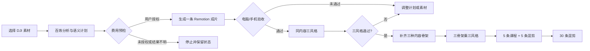

# 真实素材动态成片验收与批量放量 - Plan

## Goal Capsule

把已经接入的百炼、AI 封面和 Remotion 动态包装真正用到新的真实素材上，先产出一条可人工验收的高质量课程短片，再以同一内容做三风格对照，最后逐级扩展到课程批量和混剪批量。

本计划默认以用户指定的 DJI 课堂素材作为第一条课程片的内容主线。所有云端付费调用都必须在界面展示预计次数并获得明确授权；首轮只做内部验收，不自动发布。旧成片、原始素材和历史项目均保留，不从 dirty worktree 构建交付安装包。

## Product Contract

### Summary

本计划不再扩充一批静态模板，而是验证现有模块化 Remotion 包装能否在真实课堂素材上形成“能直接拿去继续发布”的成片。验证顺序是：一条高质量课程片、同内容三种视觉风格、三种内容骨架的三乘三对照、5 条课程加 5 条混剪、30 条混剪。

### Problem Frame

现有代码已完成 FFmpeg 中间片、Remotion 动态包装、百炼语义事件、AI 封面账本和三风格对照合同，但真实验收尚未闭环。开发库存中的 15 条旧成片虽然有视频和封面文件，却没有持久化动效计划、包装事件或 AI 封面来源凭证，因此不能作为零付费三风格对照的输入。继续增加模板或直接批量生成会把工程自检误当成内容质量证明。

### Actors

- A1. 内容制作人员：选择素材和包装方式，查看费用预估，授权一次付费生成并查看成片卡片。
- A2. 内部验收人员：在电脑和手机竖屏上检查字幕、排版、声音、封面和动态效果，记录通过或淘汰原因。
- A3. 系统维护者：确认付费账本、运行时、许可证和干净提交，再决定是否构建内部评估包或交付包。

### Requirements

#### 真实素材与费用门禁

- R1. 第一阶段重新分析用户指定的 DJI 课堂素材，生成一条全新的课程候选；候选必须保存转写、词级时间码、选段理由、动效计划、包装事件和 AI 封面来源凭证。
- R2. 生成前按转写、画面理解、选段评分、动效编导和 AI 封面分别展示预计请求数、缓存命中和本地渲染数；请求模型身份、实际服务身份和未核验状态分开记录，不能用配置成功代替调用证明。
- R3. 用户确认费用后才允许提交云端任务；提交结果不明时进入 `outcome_unknown`，不得自动重提；换包装复用已有计划和封面，重做封面才允许产生一次新的 APIMart 任务。
- R4. 旧成片缺少动效计划或 AI 封面凭证时只能标记为不合格库存，不得自动补付费调用来凑对照数量。

#### 单条质量验收

- R5. 第一条课程片时长为 30～90 秒，观点完整，不从半句话切入，输出为 9:16、1080×1920、30fps、H.264/AAC。
- R6. Remotion 成片必须保留完整原声主线，字幕词级时间与声音误差不超过 500ms；人物、课件和弹出元素排版规整，不出现黑帧、爆音、明显遮挡或音画错位。
- R7. AI 事件只决定有内容依据的出现时机和表现意图；效果来自版本化组件注册表和多个变体，不把动画写成几张固定画面反复套用，也不允许无依据的装饰文案。
- R8. 单条成片必须由 Remotion 实际渲染，并完成电脑播放和手机竖屏人工检查；系统保存候选 ID、设备、结论、原因、验收人、时间和媒体摘要，另保留源时间码、引擎、风格和封面状态。

#### 对照与批量放量

- R9. 单条质量通过后，对同一内容生成 `social_pop`、`neo_editorial` 和 `tech_motion` 三种视觉风格；三条版本复用选段、字幕、声音、动效计划和 AI 封面，变量只有视觉表现。
- R10. 三风格对照在已有有效计划和已完成 AI 封面凭证的前提下固定为百炼 0 次、APIMart 0 次、本地渲染 3 次；Remotion 不可用时停止对照，不生成三条相同的 FFmpeg 结果。
- R11. 只有三风格对照通过后，才从素材库补齐老师主讲、课件重点、设备或培训现场等不同内容骨架；每个骨架保存机器可验证的 `skeletonId`，依据镜头类型顺序、语义角色、来源区间和相似度判定，再执行三种骨架乘三种风格的九条本地对照。
- R12. 批量任务提供 1 条和 5 条试验档；执行 5 条课程片和 5 条混剪前先完成容量预检并显示上限和缺口，九条对照通过后才进入 5+5，再执行 30 条混剪；每一阶段都要检查重复度、结构顺序和模板分散，素材不足时返回最大可生成数量而不是低质量补数。

#### 安全与交付边界

- R13. 取消、暂停、重启和失败恢复不得触发错误的 FFmpeg 回退、重复付费、孤儿进程或半成品完成标记；恢复时保留不透明项目 ID 和候选上下文；原始素材、旧项目和旧成片的指纹保持不变。
- R14. motion plan、封面和渲染配方的缓存键必须覆盖素材指纹、源时间区间、转写版本、组件注册表、包装版本、品牌包和封面来源等完整输入；任一输入变化都要失效重算。
- R15. 本计划只允许内部验收和内部队列，不触发微信、抖音或快手发布；Remotion 商业许可、浏览器再分发依据、受签清单和干净提交未齐时不构建交付安装包。
- R16. 阶段门槛由任务和 UI 同时强制：没有 Remotion 实际引擎结果和手机验收通过记录时，不能创建三风格对照；没有三风格和三骨架证据时，不能提交 5+5 或 30 条批量任务。

### Flows

- F1. 单条真实成片：选择 DJI 素材 → 分析并保存计划与封面凭证 → 显示费用 → 用户授权 → 生成 Remotion 成片 → 电脑和手机验收。
- F2. 同内容三风格：选择已通过的单条成片 → 本地预检 → 一次分组任务 → 复用内容计划和封面 → 生成三个视觉版本 → 记录人工排名。
- F3. 三骨架对照：从素材库获得三个合格内容骨架 → 每个骨架复用同一内容做三风格本地渲染 → 检查内容变量和视觉变量是否分离。
- F4. 分级放量：三骨架对照通过 → 5 条课程加 5 条混剪 → 30 条混剪；任一阶段未通过就停在当前阶段并报告缺口。
- F5. 恢复与保护：任务暂停、取消、重启或渲染失败 → 保留已完成候选 → 清理私有临时文件和进程 → 仅恢复未完成且输入摘要仍匹配的部分。

### Acceptance Examples

- AE1. 新 DJI 候选带完整动效计划和 AI 封面来源，费用预检分别列出各类百炼请求，授权后生成一条 30～90 秒 Remotion 成片，并保存手机验收记录。
- AE2. 三风格对照预检显示百炼 0 次、APIMart 0 次、本地渲染 3 次；三条成片内容和声音一致，视觉表现不同。
- AE3. 缺少动效计划、封面凭证或运行时能力时，对照在提交前停止，不产生云端调用或伪造的三条结果。
- AE4. APIMart 提交或轮询结果不明时，重启和再次打开工作台都不自动重复提交，卡片明确显示待人工处理状态。
- AE5. 5+5 或 30 条任务遇到素材不足时，系统返回可生成上限和缺少的内容骨架，不用重复片段补足数量。
- AE6. 取消 Remotion 或 FFmpeg 渲染后，进程树退出、没有半成品完成记录、原素材和旧成片指纹不变。
- AE7. 任一素材、注册表、包装版本或封面来源变化后，旧计划不再命中缓存，系统重新分析或明确阻止复用。
- AE8. 没有 Remotion 实际结果、手机通过记录、三个不同 `skeletonId` 或批量容量证明时，后续阶段按钮不可提交；重启后仍能恢复同一项目和候选分组。

### Scope Boundaries

本计划包含真实素材重新入场、单条课程片质量闭环、三风格对照、三骨架三风格对照、5+5 和 30 条混剪的分级验收，以及内部验收报告和费用账本核对。

本计划不包含新的视觉风格设计、模板设计器、多轨时间线、在线 B-roll 搜索、AI 视频生成、真实渠道发布或商业交付安装包。

#### Deferred to Follow-Up Work

- AutoCut、FunClip 与本地路线的平行评分比较。
- 跨素材自动插入更多 B-roll 和更复杂的人物/课件检测框。
- 用户可编辑的动效时间线、模板市场和在线音乐素材库。

### Dependencies

- 现有内容引擎的素材分析、课程和混剪任务、motion director、包装事件、候选版本和封面账本。
- Remotion `4.0.512` 固定开发运行时、显式本机 Chrome/Edge 和本地 FFmpeg/ffprobe。
- 当前 Windows 用户已配置百炼 Key；AI 封面验收需要 APIMart Key 和可核验的付费任务账本。
- 用户可在每条第一阶段付费调用前确认费用，并在电脑和手机上观看内部样片。

## Planning Contract

### Key Technical Decisions

- KTD1. 采用“单条真实成片 → 三风格 → 三骨架三风格 → 5+5 → 30 条”的硬门槛顺序。（session-settled: user-approved — chosen over 直接批量生成: 先看真实成片质量再放量，避免低质量重复）
- KTD2. 第一条只使用用户指定的 DJI 课堂素材；后续骨架默认由素材库自动筛选，筛选不足时再请求用户补选。（session-settled: user-directed — chosen over 立即要求用户整理素材: 先降低使用门槛并保持 AI 自动化方向）
- KTD3. 视觉风格继续由注册表和组件变体驱动，六套语义包装模板只决定内容结构。（session-settled: user-approved — chosen over 固定几张模板图循环: 让 Remotion 能按事件组合不同表现）
- KTD4. 付费云操作使用分服务预估、用户授权、收据或未核验状态账本；换包装零云调用，重做封面一次调用。（session-settled: user-approved — chosen over 无预警自动提交: 控制预算并防止结果不明重复扣费）
- KTD5. motion plan 和 AI 封面属于正确性敏感缓存，缓存键覆盖所有影响输出和费用的输入，不能只依赖素材名或候选 ID。（由历史缓存失效经验确定）
- KTD6. 取消和关机以进程树退出、任务状态和文件完整性共同判定，不以父进程退出或数据库状态单独判定成功。（由 Windows 进程监督经验确定）
- KTD7. 真实素材和手机观感证据是批量放量的前置条件；源码测试和构建通过不能替代人工媒体验收。（由历史端到端验收经验确定）
- KTD8. 商业交付继续采用 fail-closed：许可证、浏览器再分发依据、干净提交和受签清单缺一项都不生成 delivery 安装包。（session-settled: user-approved — chosen over 先打包再补手续: 避免会议室安装包与源码证据不一致）
- KTD9. 首条质量验收采用 Remotion-only 模式；普通日常生成仍可保留可见 FFmpeg 回退，但回退结果不能进入视觉对照或成为下一阶段的通过证据。（由真实验收流程审查确定）

### High-Level Technical Design

费用和复用关系固定如下：

| 场景 | 百炼 | APIMart | 本地渲染 | 说明 |
|---|---:|---:|---:|---|
| 第一条新课程片 | 按转写、画面理解、选段评分、动效编导分别核算（不预设为 1） | 1 条 AI 封面任务（仅在选择 AI 封面时） | 1 | 提交前展示并等待授权 |
| 同内容三风格 | 0 | 0 | 3 | 复用计划、字幕、声音和封面 |
| 换包装 | 0 | 0 | 1 | 只换视觉表现 |
| 重做封面 | 0 | 1 | 1 | 结果不明不得自动重提 |
| 5+5 或 30 条新内容 | 按批量任务记录 | 按实际 AI 封面数量记录 | 按输出数量记录 | 先过上一阶段门槛 |

### System-Wide Impact

- 内容引擎新增的重点是资格和证据，而不是新的渲染框架：候选配方、motion plan、包装事件和封面账本必须能在重启后复核。
- 桌面工作台需要把各类百炼调用数、APIMart 调用数、实际引擎、风格、回退原因和人工验收状态放在同一张成片卡片上，并能恢复项目与候选上下文。
- 三风格和批量任务继续使用不透明候选 ID；渲染进程不获得真实源路径，云端 Key 不进入 Remotion worker、公开 props 或日志。
- 所有临时媒体和浏览器缓存只存在于工作台私有目录，取消、失败和完成后按现有清理策略处理，不触碰用户原始素材目录。

### Assumptions

- 用户允许先用 DJI 课堂素材做第一条内部实验，并在费用预估后再确认需要付费的云端调用。
- 当前素材库能够筛到至少两种额外内容骨架；如果筛不到，计划停在单条或三风格阶段并显示缺口。
- 课程和混剪 UI 能在付费前提供 1 条、5 条试验档及容量上限；如果旧版本没有这些控件，先补合同再执行云端任务。
- APIMart 的 AI 封面结果能返回可核验的任务状态；否则只保留未核验账本，不把封面标成已完成。
- 手机人工检查由用户或内部验收人员完成，系统只负责准备播放文件和证据摘要。

### Risks & Mitigations

- 计划或封面缓存过期会造成错误复用或重复扣费；使用完整输入摘要和来源凭证校验，任何漂移都失效并停止复用。
- Windows 取消可能留下 FFmpeg、Remotion 或浏览器子进程；取消后验证进程树、临时目录和媒体可解码性，取消错误不走普通回退。
- AI 返回的模型身份可能只是请求参数而非服务证明；账本区分 requested、actual 和 unverified，未核验结果不用于质量宣传。
- 真实素材质量可能不足以支撑三种骨架；先做单条和三风格，素材不足时报告上限，不用重复镜头补数。
- 动效编导的网络失败可能发生在提交前或提交后；账本必须区分明确失败、已提交待确认和结果不明，避免把所有异常永久锁死或错误重提。
- dirty worktree 和许可证不明会导致误交付；只允许开发或内部评估产物，delivery 构建继续 fail-closed。

### Sequencing

U1 先补齐新素材候选、费用预检和证据持久化；U2 用该候选完成单条媒体质量报告和手机验收；U3 在 U2 通过后运行同内容三风格并记录排名；U4 在素材骨架足够时运行三乘三；U5 在三乘三通过后分阶段放量；U6 最后复核内部包和商业交付门槛。

## Implementation Units

### U1. 新素材候选与费用证据闭环

**Goal:** 让一条新的真实课程候选具备可复用的百炼计划、包装事件、AI 封面来源和可审计的费用预检。

**Requirements:** R1-R4、R10、R14。

**Dependencies:** 现有素材分析、课程生成、封面账本和 Remotion capability 合同。

**Files:**

- `desktop/sidecars/content-engine/content_engine/creative_analysis.py`
- `desktop/sidecars/content-engine/content_engine/creative_domain.py`
- `desktop/sidecars/content-engine/content_engine/apimart_cover.py`
- `desktop/sidecars/content-engine/content_engine/protocol.py`
- `desktop/sidecars/content-engine/content_engine/service.py`
- `desktop/src/main/content-engine-ipc.cjs`
- `desktop/src/main/preload-api.cjs`
- `desktop/src/renderer/CreativeWorkspacePage.tsx`
- `desktop/sidecars/content-engine/tests/test_creative_workbench.py`
- `desktop/sidecars/content-engine/tests/test_provider_security.py`

**Approach:**

1. 以新 DJI 候选为第一条资格样本，保存计划、词级时间码、事件、源区间和封面 provenance。
2. 把转写、画面理解、选段评分、动效编导和 APIMart 计划纳入同一份预检摘要，并区分请求身份、实际身份和未核验结果。
3. 在提交、恢复和重启路径复用同一账本；缺少计划、已完成 AI 封面凭证或完整输入摘要时停止，不补付费调用。
4. 提交前必须等待用户授权；动效请求区分提交前取消、明确失败、已提交待确认、结果不明和已完成。

**Patterns to follow:** 复用现有 `creative_domain` 任务状态机、`cover_generation_ledger` 的 exact-once 状态和 IPC candidate-only 脱敏合同。

**Test scenarios:**

- 新课程素材完成分析后，候选同时包含词级时间码、motion plan、包装事件和 AI 封面 provenance。
- 费用预检按服务阶段显示百炼、APIMart 和本地渲染数量；用户未授权时不创建云端提交。
- 百炼返回不完整计划、APIMart 结果不明或关键输入摘要缺失时，任务停止且不会自动重提。
- 换包装复用计划和封面不增加云端调用；显式重做封面只创建一个新的付费账本操作。
- 公开 IPC、日志、worker 环境和错误消息中不出现 Key、源路径或输出路径。
- 提交前取消、明确失败和结果不明在账本中可区分，恢复动作不会把普通网络失败误判为已扣费。
- Electron 重启后恢复任务保留不透明项目 ID、候选分组和阶段，不把全局最新成片误显示为当前项目结果。

**Verification:** 新候选能从工作台恢复并通过资格预检；账本数字与实际 provider receipt 或 `unverified` 状态一致。

### U2. 单条高质课程片与媒体验收报告

**Goal:** 用一条真实课程片证明动态字幕、事件排版、声音和封面达到进入三风格对照的最低质量。

**Requirements:** R5-R8、R13。

**Dependencies:** U1。

**Files:**

- `desktop/sidecars/content-engine/content_engine/creative_render.py`
- `desktop/sidecars/content-engine/content_engine/remotion_render.py`
- `desktop/sidecars/content-engine/content_engine/database.py`
- `desktop/sidecars/content-engine/content_engine/protocol.py`
- `desktop/sidecars/content-engine/content_engine/service.py`
- `desktop/src/main/content-engine-ipc.cjs`
- `desktop/src/main/preload-api.cjs`
- `desktop/src/renderer/CreativeWorkspacePage.tsx`
- `desktop/remotion-packaging/contract.cjs`
- `desktop/remotion-packaging/effect-registry.json`
- `desktop/scripts/remotion-packaging.self_check.cjs`
- `desktop/sidecars/content-engine/tests/test_remotion_renderer.py`
- `desktop/sidecars/content-engine/tests/test_packaging_renderer.py`
- `PROJECT_STATUS.md`

**Approach:**

1. 保持 FFmpeg 中间片和 Remotion 视觉层的职责分离，使用已注册组件变体而不是新增一张固定模板图。
2. 为单条输出保留 ffprobe、黑帧、响度、音画同步、字幕边界和文件摘要证据，并要求实际引擎为 Remotion。
3. 通过专门的手机验收记录保存设备、结论、原因、验收人、时间和媒体摘要；只有媒体自动检查和手机人工检查均通过，才把候选标记为可进入视觉对照。

**Execution note:** 先看真实产物再决定是否继续扩动画或模板；源码自检只能证明合同，不证明审美和内容质量。

**Test scenarios:**

- 30～90 秒课程候选生成 1080×1920、30fps、H.264/AAC 文件，视频和音频都可解码。
- 词级字幕在每个活动区间内出现，间隙和片尾不残留，字幕与声音时间误差不超过 500ms。
- 事件与人物或课件保护区冲突时被改派或丢弃，注册表中的不同变体能产生稳定且不重复的视觉表现。
- Remotion 或 FFmpeg 被取消时不走错误回退，不留下可被标记为完成的半成品或残留进程。
- 原始素材、旧候选和旧封面在重渲染、失败清理和恢复后指纹不变。
- 实际引擎为 FFmpeg、手机验收记录缺失或结论不是通过时，候选不能满足三风格对照资格。
- 保存的手机验收记录能在工作台重启后按候选 ID 重新读取，且旧项目不会显示成新项目的验收结果。

**Verification:** 产出一份单条媒体验收记录，并由手机竖屏人工确认字幕、人物、课件、动态元素和声音均可接受。

### U3. 同内容三风格对照

**Goal:** 证明同一内容可以在三个 Remotion 风格之间变化，而不改变选段、字幕、声音和封面。

**Requirements:** R9-R10、R13-R14、R16。

**Dependencies:** U2。

**Files:**

- `desktop/sidecars/content-engine/content_engine/creative_domain.py`
- `desktop/sidecars/content-engine/content_engine/service.py`
- `desktop/src/renderer/CreativeWorkspacePage.tsx`
- `desktop/src/renderer/creative-workspace.self_check.cjs`
- `desktop/sidecars/content-engine/tests/test_creative_workbench.py`
- `desktop/src/main/content-engine-desktop-integration.self_check.cjs`

**Approach:**

1. 对通过 U2 的候选创建一个不可变对照组，固定计划摘要、源时间码、音频摘要、封面摘要和运行时摘要。
2. 只对已完成 AI 封面账本凭证的候选做三次本地 Remotion 渲染，卡片显示三种风格的实际引擎和版本。
3. 若能力、计划、封面凭证或运行时摘要发生变化，整个对照组停止或暂停，不生成伪重复结果。
4. UI 和服务端都检查 U2 的 Remotion 实际引擎及手机通过记录，缺一项就拒绝创建对照任务。

**Test scenarios:**

- 预检准确显示百炼 0 次、APIMart 0 次、本地 3 次，创建任务不触发新的云端调用。
- 三个版本的源时间码、字幕文本、音频摘要和封面摘要一致，视觉样式标识不同。
- 完成一个版本后暂停并重启，只渲染未完成版本，已完成版本可播放且不重复扣费。
- Remotion 不可用或运行时 hash 漂移时，对照 fail closed，不产出三个相同的 FFmpeg 版本。
- UI 任务轮询在完成、失败、暂停和取消后停止，不显示旧任务的结果。
- 没有手机通过记录、实际 Remotion 结果或已完成 AI 封面账本时，创建对照任务的请求被拒绝且账本不变。

**Verification:** 三条成片可播放，自动对照摘要证明内容变量一致；人工排名记录保留在内部验收报告中。

### U4. 三种内容骨架与三乘三对照

**Goal:** 在真实素材中获得三个可区分的内容骨架，再执行九条本地视觉对照。

**Requirements:** R11、R14、R16。

**Dependencies:** U3；素材库中至少有两个额外的合格骨架。

**Files:**

- `desktop/sidecars/content-engine/content_engine/creative_analysis.py`
- `desktop/sidecars/content-engine/content_engine/creative_domain.py`
- `desktop/src/renderer/CreativeWorkspacePage.tsx`
- `desktop/sidecars/content-engine/tests/test_creative_workbench.py`
- `desktop/sidecars/content-engine/tests/test_motion_director.py`

**Approach:**

1. 默认从素材库自动筛选老师主讲、课件重点、设备或培训现场等不同骨架；筛选不足时返回缺口并等待用户补选。
2. 为每个骨架保存 `skeletonId`，由镜头类型顺序、语义角色、来源区间和相似度共同判定，避免把同一老师讲课骨架换标题当成新骨架。
3. 每个骨架先单独通过内容完整性和时间码检查，再进入三风格本地对照；对照组之间只改变内容骨架和来源区间，组内只改变视觉风格。

**Test scenarios:**

- 同一骨架的候选被去重，不因标题轻微差异重复进入九条输出。
- 只有一个骨架或缺少有效封面时，预检返回缺口且不产生云端调用。
- 九条输出均能证明源区间、字幕时间和音频属于对应骨架，组内三风格仍保持一致。
- 九条输出存在完全相同文件或过高画面重复度时，任务报告失败而不是宣称通过。
- 三个 `skeletonId` 不足或机器判定条件不成立时，任务停在素材补齐阶段，不触发付费调用。

**Verification:** 三个骨架各有一条代表性样片和三风格结果，完成内容差异、视觉差异、文件唯一性和手机观感记录。

### U5. 5+5 与 30 条批量放量

**Goal:** 在质量门槛通过后，逐级验证课程批量和混剪批量，不以重复镜头填充数量。

**Requirements:** R12-R14、R16。

**Dependencies:** U4。

**Files:**

- `desktop/sidecars/content-engine/content_engine/creative_domain.py`
- `desktop/sidecars/content-engine/content_engine/service.py`
- `desktop/src/renderer/CreativeWorkspacePage.tsx`
- `desktop/sidecars/content-engine/tests/test_creative_workbench.py`
- `desktop/src/renderer/creative-workspace.self_check.cjs`
- `PROJECT_STATUS.md`

**Approach:**

1. 先生成 5 条课程片和 5 条混剪片，逐条记录费用、来源、风格、引擎和淘汰理由。
2. 质量通过后再把混剪上限扩到 30 条，保持开场—过程—结果顺序、镜头去重和模板分散。
3. 付费提交前执行 1 条和 5 条试验档的容量预检；素材不足、任务恢复或单条失败时，返回可生成上限和缺少角色，不静默补数；没有三风格和三骨架通过记录时，批量提交按钮保持禁用。

**Test scenarios:**

- 目标数量为 5、30 和超过容量时，预检返回准确上限并阻止超额生成。
- 批量任务不连续使用同一视觉风格超过两条，且同一源片段组合不会重复。
- 混剪输出保留开场—过程—结果顺序，老师原声连续，字幕和音频质量门槛一致。
- 批量中途暂停、取消或重启时，已完成候选可播放，未完成候选可恢复，账本不重复。
- 失败或素材不足时，UI 清楚显示缺少的镜头类型和当前最大可生成数量。
- 付费提交前容量不足时不发生百炼或 APIMart 调用，1 条试验档可独立验证批量合同。

**Verification:** 5+5 和 30 条批量均有机器检查、成本账本、重复度摘要和人工抽查结果；未通过时不进入内部发布队列。

### U6. 内部验收报告与交付门槛

**Goal:** 把真实媒体结果、费用证据、人工判断和交付限制汇总成可复核的内部报告。

**Requirements:** R2-R4、R8、R12-R16。

**Dependencies:** U2-U5。

**Files:**

- `PROJECT_STATUS.md`
- `.build/acceptance/` 下的版本化验收报告
- `desktop/scripts/portable-runtime-dependencies.self_check.cjs`
- `desktop/scripts/installer-release.self_check.cjs`

**Approach:**

1. 报告分开列出源码测试、真实媒体检查、手机人工结论、百炼/APIMart 账本和实际渲染引擎。
2. 内部评估包只能来自与运行时清单一致的固定构建；商业交付继续要求许可、浏览器再分发依据、受签清单和干净提交。
3. 任何未运行的媒体或手机检查标记为 `not_run`，不能用构建成功替代。

**Test scenarios:**

- 报告中不出现源路径、Key、私有 token 或未脱敏错误消息。
- 账本、候选数量、渲染引擎和报告摘要互相一致；结果不明操作被标记为不可重提。
- 手机验收记录中的候选、设备、结论、原因、验收人和时间能与媒体摘要对应，缺失记录的候选不被标为通过。
- 修改运行时、模板注册表或便携包后，旧信任记录和交付检查失败。
- 未记录商业许可或浏览器再分发依据时，delivery 构建明确失败，internal-evaluation 仍可单独验证。

**Verification:** 形成一份包含成本、媒体、人工和交付状态的内部验收报告；没有在真实素材和手机上完成的项目保持待验收状态。

## Verification Contract

### Automated Checks

| Gate | Applicability | Expected outcome |
|---|---|---|
| Content-engine unittest discovery | U1-U5 | All existing and new sidecar tests pass, including cache invalidation, exact-once, cancellation and batch capacity. |
| Source self-checks | U1-U6 | IPC, preload, renderer, Remotion registry, runtime and installer contracts pass. |
| Test renderer build | U1-U6 | Renderer builds from the same source tree used for acceptance. |
| Diff and secret/path scan | U1-U6 | No key, token, source path or output path leaks; no diff errors. |

### Media Checks

- `ffprobe` confirms 9:16 1080×1920, 30fps, H.264/AAC, expected duration and decodable streams.
- Black-frame, freeze-frame, peak, true-peak and loudness checks show no blocking defect; target voice loudness remains near `-16 LUFS` and peak no higher than `-1.5 dBTP`.
- Caption boundary checks prove every displayed caption has a matching word or sentence interval and no gap or tail residue.
- Same-content style groups have equal source interval, subtitle digest, audio digest and cover digest; style outputs have distinct visual/file digests.
- Batch checks prove semantic order, combination uniqueness, template spread and material capacity.

### Human Validation

- Play the single DJI course clip on desktop and phone portrait before any three-style comparison.
- Compare three visual styles for subtitle placement, title rhythm, event density, subject/slide readability and overall 2026 short-video feel.
- For 3×3, inspect one representative of each content skeleton on phone portrait and sample the remaining outputs for black frames, loudness, captions and visual repetition.
- Record pass, reject or revise with a short reason; do not treat a build or self-check as a human pass.

### Cost and Security Audit

- Before each paid stage, display planned Bailian and APIMart calls and wait for user authorization.
- After each stage, reconcile planned calls, provider receipts, `unverified` results and local renders; never infer price or model identity from configuration alone.
- Confirm 原始素材、旧项目、旧成片和封面未被删除或覆盖，并确认没有触发发布动作。

## Definition of Done

- One fresh DJI course candidate has complete motion-plan and AI-cover provenance and produces a 30–90 second Remotion video that passes automated media checks and phone review.
- The same candidate produces three distinct visual styles with 0 Bailian calls, 0 APIMart calls and 3 local renders, or the comparison stops with a recorded reason.
- If three distinct content skeletons are available, the 3×3 comparison completes with matching content variables within each group and distinct visual outputs; if not, the report records the exact inventory gap.
- Only after the preceding gates pass, 5+5 and then 30 mix acceptance runs complete with capacity, duplicate, ordering, cost and recovery evidence.
- All automated tests, self-checks and renderer builds pass for the final source tree; real media and phone checks are separately recorded.
- No cloud operation is silently retried, no original or historical user file is removed, and no real channel publish or delivery installer is produced without its explicit gate.

## Appendix

### Repository Anchors

- `docs/plans/2026-08-15-001-feat-remotion-production-packaging-plan.md` — previous implementation plan and renderer contract.
- `desktop/sidecars/content-engine/content_engine/creative_domain.py` — task, candidate, motion-plan, comparison and cover lifecycle.
- `desktop/sidecars/content-engine/content_engine/packaging.py` — semantic packaging presets, event validation and safe layout.
- `desktop/remotion-packaging/effect-registry.json` — registered effect families and variants.
- `desktop/src/renderer/CreativeWorkspacePage.tsx` — workbench generation, cost preflight, comparison and card state.
- `desktop/sidecars/content-engine/tests/test_creative_workbench.py` and `desktop/sidecars/content-engine/tests/test_remotion_renderer.py` — current domain and renderer regression patterns.
- `.build/acceptance/u6-2026-08-15-inventory-blocked/report.json` — read-only evidence that the old inventory is not comparison-eligible.

### Sources & Research

- Local repository research confirmed the existing task state machine, three-style comparison, candidate-only IPC contract, versioned effect registry and current inventory gate.
- Institutional learnings applied: complete cache invalidation inputs, verified model identity, Windows process-tree cancellation, preservation of user content, and real-artifact-first pipeline acceptance.
- No external research was needed for this phase; Remotion and the current hybrid architecture are already settled in the preceding plan.
