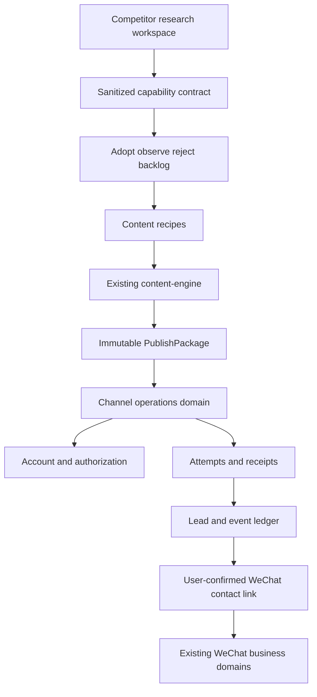
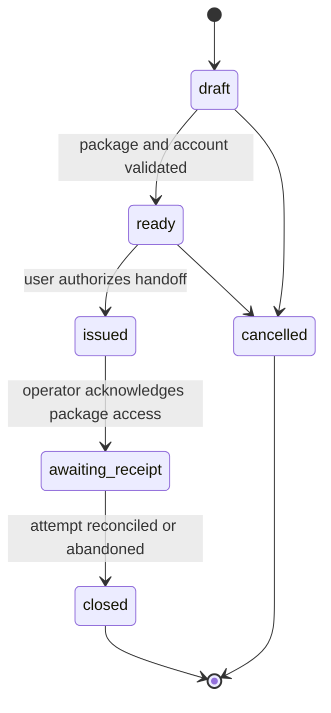
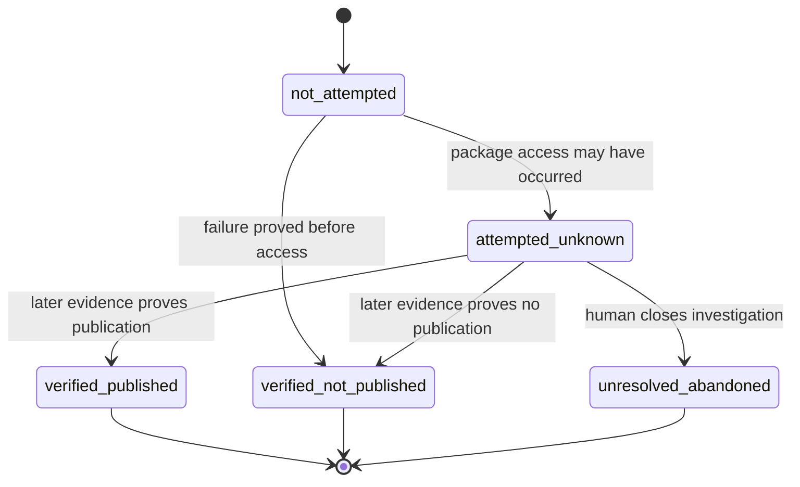
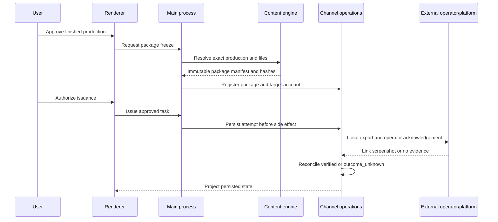

# WeChat Closeout and Content Channel Roadmap - Plan

## Goal Capsule

- **Objective:** Move the product from repeated WeChat stabilization into a repeatable content-to-channel growth loop without weakening external-action safety.
- **Means:** Use a hard WeChat graduation gate, a versioned competitor evidence factory, one consolidated content path, and a receipt-driven channel domain (KTD1-KTD5).
- **Authority:** Product behavior and safety rules in this plan override implementation convenience. `AGENTS.md`, `PRODUCT.md`, `MODULE_MAP.md`, and `PROJECT_STATUS.md` remain authoritative for repository and acceptance boundaries.
- **Execution profile:** Land one implementation unit at a time. Keep the current WeChat closeout diff separate from new reverse-engineering, content, and channel work.
- **Stop conditions:** Stop a unit if it would copy competitor assets or code, expose credentials to renderer or research artifacts, execute an unauthorized external action, or convert an uncertain external outcome into an automatic retry.
- **Tail ownership:** After the first verified channel loop, move WeChat to compatibility maintenance and run competitor version-delta analysis only against product questions selected from the backlog.

---

## Product Contract

### Summary

Close the current WeChat outreach milestone with one evidence-consistent acceptance matrix. Then establish a reusable competitor capability atlas, consolidate content production, ship a Video Channels manual-delivery loop, and add channel leads and operational reporting on top of verified receipts.

### Problem Frame

The repository already contains substantial WeChat automation and content-production foundations, but recent work is dominated by cross-machine reliability and release repair. Without a bounded graduation rule, WeChat defects can consume every future development cycle. Meanwhile, mature reference applications expose useful product patterns, but ad hoc reverse engineering produces conclusions that drift across versions and are difficult to convert into implementation work.

The largest product gap is after video creation. Existing queues are internal records and do not prove account authorization, delivery, publication, receipt, lead attribution, or business outcomes. The roadmap must close that gap without mixing content state, channel state, and WeChat business ledgers.

### Key Decisions

- **Adopt continuous evidence-led competitor research.** (session-settled: user-approved — chosen over one-off ad hoc analysis: versioned evidence can repeatedly inform the product roadmap.) Governs R5-R9.
- **Finish the WeChat core before broad feature implementation.** (session-settled: user-approved — chosen over mixing new channel work into the current bug-fix surface: one bounded acceptance gate prevents release and evidence confusion.) Governs R1-R4.
- **Rebuild behavior independently.** (session-settled: user-approved — chosen over copying competitor implementation: behavior contracts preserve product value while protecting maintainability and provenance.) Governs R7-R9.
- **Prove one channel before platform automation.** Governs R16-R21.

### Requirements

**WeChat graduation**

- R1. The graduation candidate must come from one clean commit, one incremented version, and one component package used throughout local, installed, and fault-machine acceptance.
- R2. The accepted matrix must cover the current mainstream WeChat version and at least one different WeChat version on a second machine or the original fault machine.
- R3. Graduation must fail on wrong-recipient action, duplicate external action, automatic retry after `outcome_unknown`, lost task state, lost user data, or action under ambiguous window identity.
- R4. After graduation, new WeChat work is limited to compatibility drift, safety defects, and explicitly prioritized product changes.

**Competitor capability factory**

- R5. Every competitor case must bind target name, installed version, file hashes, capture time, packaging layers, and evidence location.
- R6. Every capability must record the user job, trigger, inputs, state transitions, visible outcome, failure semantics, side effects, confidence, and product disposition.
- R7. The research flow must be `Triage -> Observe -> Capture -> Contract -> Clean-room Rebuild -> Synthetic Replay`, with uncertain evidence retained as a hypothesis.
- R8. Raw binaries, extracted code, screenshots, request bodies, login state, and runtime captures must remain outside source and release artifacts.
- R9. A competitor capability may enter the implementation backlog only after its behavior contract can be replayed without the competitor files present.

**Content production**

- R10. New general video work must follow one primary flow: material and brief, copy approval, production, review, finished work, and publish package.
- R11. Long-course, legacy mix, product one-click, and narrated histories must reopen by exact kind and exact identifiers without rewriting or deleting old records.
- R12. Every finished production type must be able to create an immutable, versioned `PublishPackage` whose manifest and retained files remain independently verifiable after issuance.
- R13. Editing approved content or files after package creation must create a new package version rather than mutate the issued package.
- R14. Content processing, rendering, and reverse-analysis work must not take the WeChat window/input lease; active WeChat work must be able to pause or reduce competing CPU, GPU, and disk work.
- R15. Provider calls and production stages with unknown results must resume from persisted checkpoints without repeating completed or potentially billable work.

**Channel distribution and operations**

- R16. The first channel must be Video Channels manual delivery through local package export and operator acknowledgement, without automated messaging, upload, or storage of passwords, cookies, and CAPTCHA state.
- R17. Package export and acknowledgement must require an explicit target account, operator, package summary, current one-time authorization receipt, and idempotency key.
- R18. Channel task state and external attempt result must be separate; closing or cancelling a task must never erase an attempted or unknown external result.
- R19. An attempt that may have reached an operator or platform must not be repeated automatically after timeout, restart, missing receipt, task cancellation, or ambiguous publication.
- R20. Publication may be verified only when evidence binds the target platform, account, package fingerprint, content identifier or link, publication time window, submitter, and verifier.
- R21. Later platform adapters must reuse the proven account, package, approval, attempt, observation, reconciliation, and receipt contracts.
- R22. Channel leads must remain in the channel domain until the user links them to one exact synchronized WeChat account and stable contact identity.
- R23. Operational reports must derive from persisted package, delivery, receipt, lead, association, and follow-up events rather than UI assumptions.
- R24. UI, AI roles, and automated tools may prepare and explain external work, but OAuth consent, credentials, real publication, and outbound follow-up remain human-gated.

### Actors

- A1. **Content operator:** selects materials, approves copy, reviews finished videos, and freezes publish packages.
- A2. **Channel operator or learner:** receives a package, publishes from the authorized phone/account, and returns evidence.
- A3. **Operations user:** verifies receipts, records or imports leads, links exact contacts, and reviews results.
- A4. **Local automation:** analyzes, renders, prepares, observes, and reconciles within explicit permissions.
- A5. **External platform:** accepts or rejects publication and exposes observable receipts or events.

### Key Flows

- F1. **WeChat graduation:** Freeze the candidate, run automated fault coverage, switch the installed component, execute the bounded two-version real-machine matrix, and record remaining non-blocking issues. Covers R1-R4.
- F2. **Capability adoption:** Select one product question, create a versioned competitor case, collect evidence by packaging layer, write a behavior contract, replay it independently, and assign `adopt`, `observe`, or `reject`. Covers R5-R9.
- F3. **Content to package:** Reopen or create a production, approve its result, freeze an immutable package, and route the package to channel work without moving content state into the channel domain. Covers R10-R15.
- F4. **Manual Video Channels delivery:** Select a package and account, approve issuance, hand it to the operator, await evidence, and reconcile to a terminal or unknown result. Covers R16-R21.
- F5. **Lead loop:** Register a lead against a verified channel task, link it to an exact WeChat contact only with user confirmation, record follow-up state, and compute the operational funnel from events. Covers R22-R24.

### Acceptance Examples

- AE1. **Covers R1-R4.** Given the same signed component candidate on two machines, when the bounded matrix passes without a graduation-blocking condition, then the version is recorded as graduated and later WeChat issues enter maintenance triage.
- AE2. **Covers R3.** Given a send click followed by lost evidence, when the workflow resumes, then the transaction remains `outcome_unknown` and no second send occurs.
- AE3. **Covers R5-R9.** Given a new `ai-auto` version, when one capability contract is replayed in an environment without competitor files, then it may enter the product backlog with its evidence and confidence links intact.
- AE4. **Covers R11-R13.** Given an old narrated, guided, mix, or product task, when the operator reopens it and freezes a package, then the exact historical result is used and any later edit produces a new package version.
- AE5. **Covers R16-R20.** Given a package issued for one Video Channels account, when no receipt returns after restart, then the task remains awaiting evidence or unknown and cannot be issued automatically again.
- AE6. **Covers R22-R23.** Given a lead that cannot be uniquely matched to a synchronized WeChat contact, when the user declines manual association, then the lead remains unlinked and operational totals do not imply a WeChat follow-up.

### Success Criteria

- One WeChat version graduates from one evidence-consistent candidate against the accepted two-version matrix.
- Each target competitor has a versioned atlas, and at least one content or publishing capability completes independent synthetic replay.
- A real material set can move through one primary content path into a frozen publish package while all supported historical task types still reopen correctly.
- One authorized Video Channels package is issued once, verified from external evidence, and visible in the operational funnel after restart.
- One real or controlled lead can be traced from channel task to package, account, optional exact WeChat association, and follow-up state.

### Scope Boundaries

**Deferred to Follow-Up Work**

- Automated Video Channels publication after the manual-delivery contract is proven and a separate login/authorization design is approved.
- Douyin, Kuaishou, Xiaohongshu, and additional channel adapters after the first channel passes real acceptance.
- Automated comment/private-message ingestion, scheduled engagement, attribution experiments, and multi-channel optimization.
- AI-generated images or video, cross-material automatic B-roll, large multi-style batches, CRM replacement, and multi-user collaboration.

**Outside this product's identity**

- Copying or redistributing competitor source, assets, models, templates, certificates, keys, accounts, or private services.
- Circumventing access control, platform authorization, CAPTCHA, or terms acceptance.
- A universal agent that holds every credential and can perform irreversible actions without per-action authorization.
- Treating compilation, static decompilation, queue insertion, or API success as customer-visible publication success.

### Dependencies

- The current 1.1.25 closeout diff must be resolved before new roadmap code begins.
- Real WeChat graduation needs the original fault machine, one different-version environment, and authorization for named test accounts and contacts.
- Dynamic competitor observation that touches login state, hooks, or external actions requires separate authorization; static read-only analysis does not.
- Channel issuance needs an approved Video Channels test account and operator, but package and local state work can proceed before that access is available.

---

## Planning Contract

### Key Technical Decisions

- KTD1. **Use a hard graduation gate instead of a time-based handoff.** (session-settled: user-approved — chosen over indefinite WeChat polishing: only defined safety and continuity defects block the roadmap.) Implements R1-R4.
- KTD2. **Store competitor knowledge as versioned contracts and indexes, not extracted artifacts.** (session-settled: user-approved — chosen over ad hoc reverse notes and source copying: structured evidence is reusable, diffable, and separable from shipped code.) Implements R5-R9.
- KTD3. **Consolidate content navigation and package output without merging mature production engines.** Existing recipes keep their processors while sharing exact-history routing and a single package contract. Implements R10-R15.
- KTD4. **Create a separate `channel-operations` domain with versioned cross-domain references.** Content-engine owns finished work and immutable packages; channel operations snapshots the minimum issued-package facts and owns accounts, approvals, attempts, receipts, leads, and events. Implements R16-R24.
- KTD5. **Prove manual Video Channels delivery before automatic platform adapters.** The first vertical slice establishes authorization, idempotency, receipts, and operational value without storing browser or phone login state. Implements R16-R21.
- KTD6. **Use an authoritative append-only ledger plus rebuildable snapshots for the first channel.** A single serialized main-process writer assigns monotonic event IDs, persists the attempt marker before side effects, detects partial tails, and rebuilds projections idempotently. Implements R18-R23.
- KTD7. **Expose agent-safe primitives, not a privileged workflow agent.** AI roles may inspect state and prepare proposals; external irreversible actions require human approval and auditable tool results. Implements R24.

### High-Level Technical Design









### Output Structure

```text
docs/research/competitors/
  atlas.schema.json
  capability-catalog.md
  dt-ai-helper/<version>/
    capabilities.json
    evidence-index.json
  ai-auto/<version>/
    capabilities.json
    evidence-index.json
desktop/src/main/channel-operations/
  platform-registry.cjs
  package-controller.cjs
  account-store.cjs
  approval-store.cjs
  publish-task-store.cjs
  receipt-store.cjs
  lead-store.cjs
  event-ledger.cjs
desktop/src/renderer/channel-operations/
  ChannelAccountsPage.tsx
  PublishTasksPage.tsx
  LeadsPage.tsx
  OperationsDashboardPage.tsx
```

### Sequencing

U1 is the only unit allowed to modify the current WeChat closeout surface. U2 may start with documentation and read-only tooling after U1 freezes the candidate, but U3-U7 begin only after graduation. Any exception requires a separately approved roadmap change tied to one named blocker. U3 and U4 establish the content-to-package contract. U5 and U6 prove the first external loop. U7 depends on verified channel records.

### System-Wide Impact

- **Users:** Operators gain one primary creation path and explicit publication evidence instead of placeholder availability.
- **Data:** Existing content and WeChat data remain in place. Cross-domain references include domain, database instance, entity kind, stable ID, version, and manifest digest; missing sources become explicit broken references and never fall back by display name.
- **Security and privacy:** Credentials remain in protected main-process storage. Research indexes contain hashes and sanitized facts, not customer content or login state.
- **Operations:** Local checks, installed component switches, real WeChat actions, real channel publication, and business outcomes remain separate evidence stages.
- **Resources:** Rendering, reverse analysis, and WeChat RPA use separate queues and locks so CPU-heavy work cannot obtain window-control authority.
- **Agent parity:** Read and preparation actions can become tools. OAuth, real send, real publish, and outbound follow-up remain human-gated.

### Risks and Mitigations

| Risk | Mitigation |
|---|---|
| WeChat never reaches a practical stopping point | Block graduation only on R3 failures; move other defects to a maintenance backlog. |
| Competitor evidence becomes stale | Bind every claim to version and hash; mark old contracts for revalidation after file change. |
| Research artifacts contaminate releases | Keep raw output outside the repo and add generic release-tree denial rules plus a sanitized index self-check. |
| Content consolidation breaks history | Route by exact kind and identifiers; characterize every existing production type before changing navigation. |
| Internal queues are mistaken for external publication | Create a separate channel domain and remove renderer authority to mark external success without a receipt. |
| Platform or operator gives no reliable receipt | Persist `outcome_unknown`, prevent re-issuance, and require later reconciliation. |
| Event and snapshot writes diverge after a crash | Treat the ledger as authoritative, serialize writers, quarantine an invalid tail, and rebuild snapshots from the last applied sequence. |
| Issued package evidence is deleted or retargeted | Store package versions outside candidate cascade deletion and prohibit cleanup while attempts, receipts, or leads reference them. |
| A component rollback opens a newer incompatible schema | Version every schema, fail closed on incompatibility, and restore a consistent pre-migration backup rather than partially reversing records. |
| Early abstractions create empty multi-channel interfaces | Build the first adapter contract from the verified Video Channels manual flow. |
| Metrics overstate business outcomes | Derive each funnel count from persisted events and keep delivered, published, lead, and followed-up states distinct. |

### Sources and Research

- `PROJECT_STATUS.md` defines current acceptance gaps and records prior `Observe -> Capture -> Rebuild` evidence.
- `PRODUCT.md` defines the content-production flow, data preservation, AI boundary, and current no-auto-publish constraint.
- `MODULE_MAP.md` defines renderer/main/RPA/content ownership and queue isolation.
- `desktop/sidecars/content-engine/content_engine/production_summary.py` and `desktop/src/renderer/content-production-types.ts` provide the existing exact-history projection pattern.
- `desktop/sidecars/content-engine/content_engine/mix_domain.py`, `creative_domain.py`, and `database.py` show current internal queues and their missing external-result semantics.
- `desktop/src/main/atomic-file.cjs` provides the existing atomic persistence pattern.
- Ghidra headless analysis, Version Tracking, and BSim support repeatable native analysis, while Electron ASAR and PyInstaller need their own extraction workflows: https://github.com/NationalSecurityAgency/ghidra and https://github.com/NationalSecurityAgency/ghidra/blob/master/Ghidra/RuntimeScripts/support/analyzeHeadlessREADME.md.

---

## Implementation Units

### U1. Graduate the current WeChat milestone

- **Goal:** Turn the current 1.1.25 work into one accepted candidate and a durable maintenance gate.
- **Requirements:** R1-R4; F1; AE1-AE2; KTD1.
- **Dependencies:** None.
- **Files:**
  - `PROJECT_STATUS.md`
  - `desktop/release-capabilities.json`
  - `desktop/scripts/run-self-checks.cjs`
  - `desktop/rpa/active_touch/touch_task_state.cjs`
  - `desktop/rpa/active_touch/wechat_search_result_resolver.cjs`
  - `desktop/rpa/active_touch/self_check.cjs`
  - `desktop/src/main/touch-workflow.cjs`
  - `desktop/src/main/wechat-workflow.cjs`
  - `desktop/src/main/wechat-workflow.self_check.cjs`
  - `desktop/src/main/cloud-maintenance.cjs`
  - `desktop/src/main/cloud-maintenance.self_check.cjs`
  - `desktop/src/main/component-store.cjs`
  - `desktop/src/main/touch-message-sequence.self_check.cjs`
  - `desktop/scripts/component-update-selftest.cjs`
  - `desktop/package.json`
  - `desktop/src/shared/customer-release-notes.json`
  - `docs/releases/<version>-internal.md`
  - `docs/wechat-graduation-matrix.md`
- **Approach:** Freeze the named closeout surface. Add `touch-message-sequence.self_check.cjs` to the aggregate self-check. Record one versioned matrix that ties source, package, machines, WeChat versions, accounts, scenarios, and observed results together.
- **Execution note:** Characterize current failure and resume behavior before altering the dirty closeout files. Build success is only the first proof layer.
- **Patterns to follow:** `docs/internal-release.md`, `desktop/release-capabilities.json`, and the existing per-stage `not_attempted`, `sent_verified`, and `outcome_unknown` semantics.
- **Test scenarios:**
  - Covers AE1. A normal contact receives text, image, and URL once on the current WeChat version, and the same installed candidate continues after restart.
  - Covers AE2. A click followed by missing verification persists one unknown attempt and never resends on resume.
  - A missing contact and an OCR split-name contact are safely skipped or resolved without stopping unrelated contacts.
  - Auto reply processes one new message and one startup unread occurrence exactly once.
  - One Moments publication and one interaction bind the intended post before the irreversible action.
  - Component switching preserves runtime data and can be traced to the same candidate hash.
- **Verification:** Targeted self-checks and `npm.cmd run check:self` pass; `npm.cmd run build:test` passes; the internal-test payload is read back and both machines activate the same signed component archives; installed switching preserves data; the authorized two-version matrix has no R3 failure.

### U2. Establish the competitor evidence factory

- **Goal:** Make reverse engineering repeatable, versioned, sanitized, and convertible into backlog decisions.
- **Requirements:** R5-R9; F2; AE3; KTD2.
- **Dependencies:** U1 candidate freeze; full implementation work waits for U1 graduation.
- **Files:**
  - `docs/research/competitors/atlas.schema.json`
  - `docs/research/competitors/capability-catalog.md`
  - `docs/research/competitors/dt-ai-helper/<version>/capabilities.json`
  - `docs/research/competitors/dt-ai-helper/<version>/evidence-index.json`
  - `docs/research/competitors/ai-auto/<version>/capabilities.json`
  - `docs/research/competitors/ai-auto/<version>/evidence-index.json`
  - `desktop/scripts/competitor-atlas.self_check.cjs`
  - `desktop/scripts/build-portable-release.cjs`
- **Approach:** Store only sanitized contracts and indexes in the repository. Route Electron bundles, V8 JSC, PyInstaller, and native files through format-specific tools. Protect releases with an allowlisted manifest plus denied research paths, competitor digests, and extracted-tree markers; an extension-only rule would reject legitimate Electron files.
- **Execution note:** Begin each case from a concrete product question and a fresh version/hash inventory. Do not bulk-decompile without a contract target.
- **Patterns to follow:** Existing release-boundary checks and the `Observe -> Capture -> Rebuild` evidence discipline in `PROJECT_STATUS.md`.
- **Test scenarios:**
  - A valid case with target, version, hashes, capability IDs, evidence grades, and dispositions passes schema validation.
  - A case missing hashes or using an unregistered evidence type fails with a precise reason.
  - A changed target hash marks dependent capabilities as requiring revalidation rather than silently updating the old case.
  - A sanitized synthetic replay succeeds after competitor files and runtime captures are removed from the test environment.
  - A release tree containing a known competitor digest, denied research path, extracted-tree marker, or capture payload is rejected without blocking allowlisted application EXE, DLL, and ASAR files.
- **Verification:** Both installed targets have immutable current-version cases; one `ai-auto` capability and one `dt-ai-helper` capability reach contract disposition; the source and portable-release trees contain no raw competitor artifact.

### U3. Consolidate content navigation and exact-history recovery

- **Goal:** Present one primary production path while preserving specialized engines and every historical task.
- **Requirements:** R10-R11, R14-R15; F3; AE4; KTD3.
- **Dependencies:** U1.
- **Files:**
  - `desktop/src/renderer/App.tsx`
  - `desktop/src/renderer/content-production-types.ts`
  - `desktop/src/renderer/ContentProductionRouter.tsx`
  - `desktop/src/renderer/ContentProductionRouter.self_check.cjs`
  - `desktop/src/renderer/BatchCreativePage.tsx`
  - `desktop/src/renderer/CreativeWorkspacePage.tsx`
  - `desktop/src/renderer/CreativeStudioPage.tsx`
  - `desktop/src/renderer/ProductOneClickPage.tsx`
  - `desktop/sidecars/content-engine/content_engine/production_ref.py`
  - `desktop/sidecars/content-engine/content_engine/production_summary.py`
  - `desktop/sidecars/content-engine/tests/test_production_ref.py`
  - `desktop/sidecars/content-engine/tests/test_production_summary.py`
- **Approach:** Add a canonical content-engine production reference that validates kind and identifier ownership before renderer routing. Replace overlapping renderer booleans with one versioned route state. Keep general creation in `BatchCreativePage`, product-specific work in `ProductOneClickPage`, legacy recovery in `CreativeWorkspacePage`, and history projection in `CreativeStudioPage`.
- **Execution note:** Add recovery characterization before changing navigation. Do not migrate or delete old task data in this unit.
- **Patterns to follow:** `production_summary.py` exact `taskId`, `batchId`, `sessionId`, and `runId` grouping plus `content-production-types.ts` DTOs.
- **Test scenarios:**
  - New general production opens the primary brief-to-production path.
  - Product work opens its specialized path without changing general defaults.
  - Narrated batch, guided session, auto-mix, and legacy task histories reopen the exact selected record.
  - A failed older task reopens itself rather than the newest task from the same project.
  - Valid identifiers from different ownership graphs produce an explicit broken-reference state rather than opening another task.
  - Restart preserves the active route and approved work without changing source materials or finished summaries.
- **Verification:** All four history families reopen from production history; one real-material flow reaches a reviewable finished video; old entry points remain accessible only where required for compatibility.

### U4. Freeze a universal PublishPackage

- **Goal:** Create one immutable handoff from every supported finished production into channel operations.
- **Requirements:** R12-R15; F3; AE4; KTD3-KTD4.
- **Dependencies:** U3.
- **Files:**
  - `desktop/sidecars/content-engine/content_engine/database.py`
  - `desktop/sidecars/content-engine/content_engine/packaging.py`
  - `desktop/sidecars/content-engine/content_engine/creative_domain.py`
  - `desktop/sidecars/content-engine/content_engine/mix_domain.py`
  - `desktop/sidecars/content-engine/content_engine/service.py`
  - `desktop/sidecars/content-engine/content_engine/protocol.py`
  - `desktop/sidecars/content-engine/tests/test_publish_package.py`
  - `desktop/src/main/content-engine-ipc.cjs`
  - `desktop/src/main/content-engine-ipc.self_check.cjs`
- **Approach:** Resolve the canonical production reference, stage files in managed storage, verify canonical manifest digests, and atomically expose a package version. Package records must not cascade-delete with legacy candidates; cleanup is allowed only when no issued attempt, receipt, or lead references the version. Keep legacy internal queues readable but prevent them from asserting external publication success.
- **Execution note:** Prove package creation for each production family before wiring the channel UI.
- **Patterns to follow:** Existing content-engine packaging, hashing, rights metadata, provider-usage ledger, and main-process path opacity.
- **Test scenarios:**
  - Each supported production family creates a package tied to the exact source record.
  - Two requests for unchanged approved content resolve idempotently to the same package version.
  - Changing title, copy, cover, media, or rights snapshot creates a new package version.
  - Missing, changed, unreadable, or unauthorized files stop package issuance with a specific reason.
  - Package hash tampering is detected before registration or delivery.
  - Disk-full, process-stop, and file-lock failures during staging never expose a partial package.
- **Verification:** A package survives source archival and restart; interrupted staging is recoverable; migration is transactional and idempotent; database integrity, foreign keys, record counts, historical hashes, and retained files match the pre-migration baseline.

### U5. Add the channel domain, platform registry, and account records

- **Goal:** Establish isolated channel ownership and make placeholder account state truthful.
- **Requirements:** R16-R18, R21, R24; F4; KTD4-KTD7.
- **Dependencies:** U4.
- **Files:**
  - `desktop/src/shared/channel-platforms.json`
  - `desktop/src/main/runtime-data.cjs`
  - `desktop/src/main/channel-operations/platform-registry.cjs`
  - `desktop/src/main/channel-operations/account-store.cjs`
  - `desktop/src/main/channel-operations/approval-store.cjs`
  - `desktop/src/main/channel-operations/event-ledger.cjs`
  - `desktop/src/main/channel-operations/channel-operations-ipc.cjs`
  - `desktop/src/main/channel-operations/channel-operations.self_check.cjs`
  - `desktop/src/main/preload.cjs`
  - `desktop/src/renderer/channel-operations/ChannelAccountsPage.tsx`
  - `desktop/src/renderer/App.tsx`
  - `desktop/src/renderer/AgentHome.tsx`
- **Approach:** Implement `wechat_channels` plus `unknown/unsupported` first and keep chat and Moments distinct. Persist schema-versioned account, operator, and one-time approval records in `channel_operations/`. Each approval freezes package digest, platform, account version, operator, action, expiry, preview digest, and provenance.
- **Patterns to follow:** `runtime-data.cjs`, `atomic-file.cjs`, minimal preload IPC, role projections, and protected-credential boundaries.
- **Test scenarios:**
  - Video Channels resolves to `wechat_channels`; future platforms remain `unknown/unsupported` until their post-U6 adapter unit.
  - `wechat_channels` cannot be confused with WeChat chat or Moments actions.
  - Registering an account without a password or cookie persists the required operator and display metadata.
  - Invalid platform IDs, duplicate account references, or renderer-supplied local paths are rejected.
  - UI shows disconnected, registered, and unavailable states from main-process truth rather than static copy.
- **Verification:** Account and approval state recovers after restart; unknown schema fails closed; deterministic migration archives the prior state; no protected field crosses preload; content-engine and WeChat business ledgers remain unchanged.

### U6. Ship receipt-driven Video Channels manual delivery

- **Goal:** Issue one frozen package once, collect external evidence, and reconcile publication without unsafe retries.
- **Requirements:** R16-R21, R24; F4; AE5; KTD4-KTD7.
- **Dependencies:** U4-U5.
- **Files:**
  - `desktop/src/main/channel-operations/package-controller.cjs`
  - `desktop/src/main/channel-operations/publish-task-store.cjs`
  - `desktop/src/main/channel-operations/receipt-store.cjs`
  - `desktop/src/main/channel-operations/channel-operations.self_check.cjs`
  - `desktop/src/renderer/channel-operations/PublishTasksPage.tsx`
  - `desktop/src/renderer/App.tsx`
  - `desktop/src/renderer/AgentHome.tsx`
- **Approach:** Export only to a user-selected local destination and record operator acknowledgement; do not upload or message automatically. Consume a one-time approval receipt, then persist an immutable attempt before access may occur. Keep task lifecycle separate from attempt result. Receipt evidence is copied into managed storage, hashed, and reconciled only by main-process rules.
- **Execution note:** Start with fault-injection coverage for issuance and reconciliation, then run one authorized phone publication.
- **Patterns to follow:** WeChat per-attempt markers, `outcome_unknown`, atomic persistence, immutable feedback snapshots, and idempotent receipts.
- **Test scenarios:**
  - An authorized account receives one package and the issued attempt survives restart.
  - Missing authorization, mismatched account, changed hash, or invalid package blocks before issuance and permits a corrected retry.
  - Timeout after issuance enters awaiting evidence or `outcome_unknown` and disables automatic re-issuance.
  - Duplicate clicks reuse the attempt idempotency key and do not create a second handoff.
  - Evidence binding platform, account, package fingerprint, content identifier or link, publication window, submitter, and verifier marks publication verified exactly once.
  - Conflicting or ambiguous screenshots remain unverified until a human resolves them.
  - Resolving an unknown as not published preserves the original attempt and requires a new approval and attempt for any later issuance.
- **Verification:** One real authorized Video Channels package moves from approved content to local export, operator acknowledgement, and externally verified publication; restart, crash-boundary, duplicate-window, and timeout tests prove there is no duplicate attempt.

### U7. Add leads, contact association, and the operational funnel

- **Goal:** Trace verified publication into channel leads, optional exact WeChat association, follow-up state, and truthful metrics.
- **Requirements:** R22-R24; F5; AE6; KTD4, KTD6-KTD7.
- **Dependencies:** U6.
- **Files:**
  - `desktop/src/main/channel-operations/lead-store.cjs`
  - `desktop/src/main/channel-operations/event-ledger.cjs`
  - `desktop/src/main/channel-operations/channel-operations-ipc.cjs`
  - `desktop/src/main/channel-operations/channel-operations.self_check.cjs`
  - `desktop/src/renderer/channel-operations/LeadsPage.tsx`
  - `desktop/src/renderer/channel-operations/OperationsDashboardPage.tsx`
  - `desktop/src/renderer/App.tsx`
  - `desktop/src/renderer/AgentHome.tsx`
- **Approach:** Bind every lead to versioned platform, account, publish task, package, content, and operator references. Associate only by owning WeChat account plus stable `wxid` or contact ID, contact-snapshot revision, user decision, and timestamp. Renames or resyncs may mark links stale but never retarget them. Compute funnel metrics by replaying the authoritative event ledger.
- **Patterns to follow:** Existing exact contact identity rules, business-state separation in `MODULE_MAP.md`, append-only provider usage events, and projection-only renderer state.
- **Test scenarios:**
  - A verified channel task accepts one lead and repeated import of the same source event remains idempotent.
  - An ambiguous or missing WeChat contact remains unlinked and cannot trigger follow-up.
  - A user-confirmed exact contact association persists without modifying `active_touch/contacts.json`.
  - Outbound follow-up preparation is allowed, but the actual send requires the existing WeChat authorization and result contract.
  - Dashboard totals distinguish packages, issued tasks, awaiting receipts, verified publications, leads, linked contacts, and follow-ups.
  - Rebuilding projections from events after restart yields the same totals and source links.
- **Verification:** One controlled lead is traceable end to end; duplicate or truncated events are recovered idempotently; stale and ambiguous identities remain non-actionable; dashboard counts reconcile to exact contributing event IDs.

---

## Verification Contract

| Gate | Applies to | Required evidence |
|---|---|---|
| Targeted syntax and self-checks | U1-U7 | New or changed state, IPC, routing, package, and domain checks pass without unrelated test expansion. |
| `npm.cmd run check:self` from `desktop/` | U1 and release-bearing units | Aggregate checks include the new critical contracts and pass from the candidate commit. |
| `npm.cmd run build:test` from `desktop/` | Every source-bearing unit | Renderer and Electron integration compile after each unit. |
| Content-engine tests | U3-U4 | Exact history, immutable packages, hashing, restart recovery, and no source mutation pass. |
| Portable/release boundary checks | U2, U4-U6 | Raw competitor artifacts, local paths, credentials, and unapproved runtime data are absent. |
| Installed component switch | U1, U3-U7 | Both an existing-data profile and a fresh profile survive an actual incremental switch; each release uses a new version and the previous accepted component base. |
| Real WeChat acceptance | U1 | Authorized two-version matrix passes on the same candidate; source tests do not substitute for this evidence. |
| Real phone/channel acceptance | U6 | One authorized Video Channels publication is issued once and reconciled from external evidence. |
| Business trace acceptance | U7 | One lead can be traced through channel, account, task, package, content, optional contact link, and follow-up state. |

Verification records must state source/build, installed package, real device or platform, and user acceptance separately. A later unit may reuse unchanged evidence only when the source, runtime, data schema, and relevant external contract remain identical.

For each release-bearing unit, go/no-go requires a clean commit, CI, compatible component base, composition check, backup, internal-test publication readback, client download/switch/restart, and feature acceptance. A new generation that cannot start may use previous-generation recovery. A behavior failure stops promotion and requires a higher-version fix. An incompatible data migration restores the complete pre-migration data set; old code must not open a newer unsupported schema. Rolling back code cannot undo or repeat an issued external attempt.

---

## Definition of Done

- U1 is done only when the same candidate passes the automated gate, installed switch, current-version real flow, fault-machine replay, and different-version regression without an R3 failure.
- U2 is done only when both current target applications have immutable version cases and at least two capabilities have reproducible sanitized contracts.
- U3 is done only when one primary entry works and every existing history family reopens the exact selected task after restart.
- U4 is done only when every supported finished production can freeze and verify an immutable package without altering source files or history.
- U5 is done only when platform and account truth is persisted in the channel domain and UI no longer presents static placeholders as connected capability.
- U6 is done only when one real authorized Video Channels task is issued once, survives restart, and reaches verified or deliberately unresolved state from evidence.
- U7 is done only when leads and metrics reconcile from persisted events and no ambiguous lead can become a WeChat follow-up automatically.
- All new external-action paths preserve authorization, idempotency, audit records, and `outcome_unknown` semantics.
- Existing content, WeChat state, credentials, and user originals remain intact across migration and incremental update.
- Documentation, module maps, capability status, and customer-visible release notes match verified behavior.
- Abandoned prototypes, duplicate routes, temporary capture files, raw competitor artifacts, and dead-end code are removed from the final diff and release tree.
